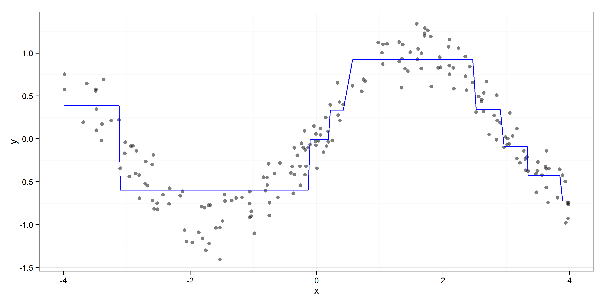
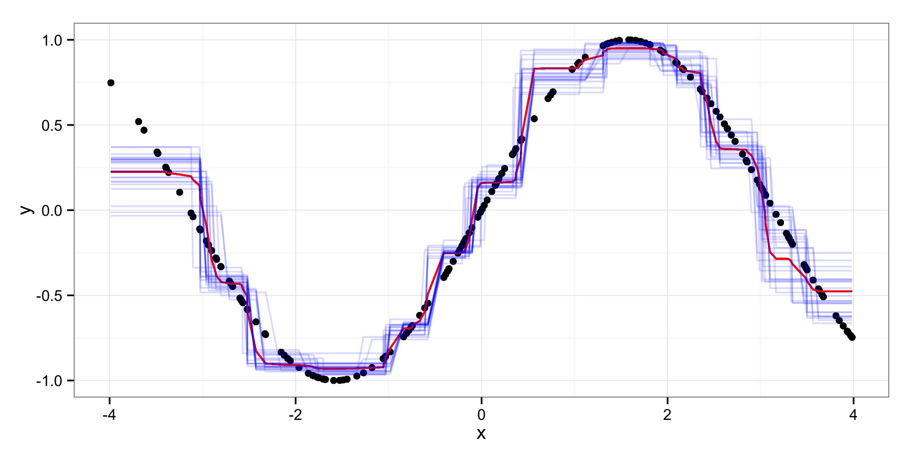
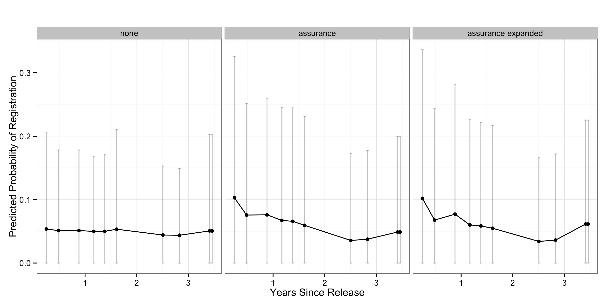

% Exploratory Data Analysis using Random Forests
% Zachary Jones and Fridolin Linder[^contact]

[^contact]: Zachary M. Jones is a Ph.D. student in political science at Pennsylvania State University ([zmj@zmjones.com](mailto:zmj@zmjones.com)). Fridolin Linder is a Ph.D. student in political science at Pennsylvania State University ([fridolin.linder@gmail.com](mailto:fridolin.linder@gmail.com)).

\begin{abstract}
As computational power has increased machine learning algorithms have seen wider use in many disciplines, however, they are still widely considered to be "black box" models that are not suited for substantive research; only prediction. We argue that this need not be the case, and present one method, random forests, with an emphasis on practical application for exploratory analysis and substantive interpretation. Random forests detect interaction and nonlinearity without prespecification, have low generalization error, do not overfit, and can be used with many correlated predictors. Importantly, they can be interpreted in a substantively relevant way with measures of variable importance, partial dependence, and several other methods. We provide intuition as well as technical detail about how random forests work, in theory and in practice, as well as an empirical example from the literature on American politics. We also provide software to facilitate the substantive interpretation of random forests and guidance on when random forests may be useful.
\end{abstract}

\clearpage

## Introduction

Political scientists have, in recent years, begun to utilize more flexible algorithmic methods for inferring substantive relationships from data [@beck1998beyond; @beck2000improving; @hainmueller2013kernel]. These methods can often outperform more commonly used regression methods at predicting data not used to fit the model, which is useful for policymakers and serves as a useful check of the explanatory power of our theories [@@hill2014empirical;@ward2010perils]. Many of these methods are commonly thought of as "black box," that is, they predict well, but do not permit substantive interpretation [@breiman2001statistical]. We show that this is not the case with a method that has not been widely used in political science so far[^exceptions], random forests [@breiman2001random]. We demonstrate how random forests provide a flexible and easy to use framework for exploratory data analysis (EDA).

Although EDA is not very prominent in published work in political science, it can be viewed as a basic building block of every scientific agenda [@tukey1977exploratory; @gelman2004exploratory; @shmueli2010explain]. Especially in settings where only observational data is available, and the observations are generated from a complex processes for which it is difficult to write a believable generative model, as is often the case in political science, EDA can prove useful. However it can also be useful for experiments and quasi-experiments as well; both for looking for interactions with the treatment(s) as well as studying the predictors and the outcome of interest.

In this paper, we demonstrate that random forests are useful tools for EDA. They can be easily used with all common forms of outcome variables: continuous, discrete, and censored (survival) outcomes. Furthermore, they do not require distributional assumptions. They can approximate arbitrary functional forms between explanatory and outcome variables, making it easy to discover complex nonlinear relationships that with many standard methods would be miss if not explicitly specified. These relationships can be visualized and interpreted using partial dependence plots. Furthermore, random forests are capable of detecting interactions of any order between predictors, without specifying them in advance. Graphical and maximal subtree methods can be used to extract and substantively interpret these interactions. The importance of variables can be assesed by their impact on the accuracy of predictions, which allows for a quick assesment of the relevance of a predictor for the outcome of interest. Finally, random forests can be used to assess the similarity of observations in the predictor space, which, when units are named, may provide insight into similarities that may not be obvious, and provides further information about the importance of explanatory variables.

In this paper, we provide an accessible introduction to the algorithm and the methods used to extract substantive insights mentioned above. First, we give an introduction to classification and regression trees (CART) that are the basic building blocks of the random forest. We then describe their combination into an ensemble that is the random forest. In the remainder of the paper we describe methods that can be used to extract substantive insights from the fitted forest. We illustrate these methods using data from a recent turnout experiment on ex-felons in Connecticut [@gerber2014can]. There are several packages in \texttt{R} to estimate random forests, however, the methods to extract substantive insight are insufficiently general, do not exploit parallelization when it is possible, are only available in some packages, lack a consistent interface, and lack the ability to generate publication quality visualizations. Therefore, accompanying to this paper, we developed an \texttt{R} package, that allows to easily compute and visualize these methods for EDA with all of the major random forest \texttt{R}-packages[^edarf].

[^exceptions]: Although there have been some exceptions @grimmer2015we, @hill2014empirical.

[^edarf]: The package is currently available in its developement version at <https://github.com/zmjones/edarf>
. The packages supported are [party](http://cran.r-project.org/web/packages/party/index.html) (`cforest`), [randomForest](http://cran.r-project.org/web/packages/randomForest/index.html), and [randomForestSRC](http://cran.r-project.org/web/packages/randomForestSRC/index.html) (`rfsrc`).

## Classification and Regression Trees

Classification and regression trees (CART) are a regression method that relies on repeated partitioning of the data to estimate the conditional distribution of a response given a set of predictors. Let the outcome of interest be a vector of observations $\mathbf{y} = (y_1,\ldots,y_n)^T$ and the set of explanatory variables or predictors a matrix $\mathbf{X} = (\mathbf{x}_1,\ldots,\mathbf{x}_p)$, where $\mathbf{x}_j = (x_{1j},\ldots,x_{nj})^T$ for $j \in \{1,\ldots,p\}$. The goal of the algorithm is, to partition $\mathbf{y}$ conditional on the values of $\mathbf{X}$ in such a way that the resulting subgroups of $\mathbf{y}$ are as homogeneous as possible.

The algorithm works by considering every unique value in each predictor as a candidate for a binary split, and calculating the homogeneity of the subgroups of the outcome variable that would result by grouping observations that fall on either side of this value. Consider the (artificial) example in Figure \ref{fig:cart_visu}. $\mathbf{y}$ is the vote choice of $n = 40$ subjects (18 republicans and 22 democrats), $\mathbf{x}_1$ is the ideology of the voter and $\mathbf{x}_2$ is the age. 

The goal of the algorithm is to find homogeneous partitions of $\mathbf{y}$ given the predictors. The algorithm starts at the upper right panel of Figure \ref{fig:cart_visu}, the complete data is the first node of the tree. We could classify all cases as Democrats yielding a misclassification rate of $18/40 = 0.45$. But it is obvious that there is some relationship between ideology and vote choice (the D's are mostly on the right side and the R's mostly on the left side), so we could do better in terms of classification error using this information. Formally the algorithm searches through all unique values of both predictors and calculates the number of cases that would be misclassified if a split would be made at that value and all cases on the left and right of this split are classified according to the majority rule. The upper right panel displays this step for one value of ideology (which also turns out to be the best possible split). In the tree in the lower left panel of Figure \ref{fig:cart_visu} the split is indicated by the two branches growing out of the first node. The variable name in the node indicates that the split was made on ideology. To the left of an ideology value of $3.31$ most of the subjects voted Republican and on the right most voted Democrat. Therefore we classify all cases on the left and right as Republican and Democrat respectively (indicated by the shaded areas in the scatterplots). Now only 8 cases are misclassified, yielding an error rate of $8/40 = 0.2$.

![Visualization of a recursive partitioning algorithm for classification. The upper left panel displays the original data. The two panels on the right display the partitions of the original data after the first and the second split respectively. The lower left panel displays the corresponding decision tree. The blue and red shaded areas in the right panels indicate the value for the fitted value of the terminal node. The shading of the area visualizes classification as Republican (red) or Democrat (blue) by majority rule. The red colored letters indicate incorrect classifications under this rule. \label{fig:cart_visu}](figures/cart.png)

The algorithm then looks for further splits within the two new partitions (left and right of $c_{x_1} = 3.21$. It turns out that for the right side there is no split that decreases the misclassification rate sufficiently (we talk about the criteria for making stopping decisions later). This is shown in the tree as a so called terminal node on the right branch of the ideology split. The plot in the terminal node displays the distribution of cases in this partition of the data. 

However, age still contains information to improve the partitioning. At the second node (i.e. all data that falls left of the first split), when splitting the data into subjects older or younger then 51 years, we can obtain a completely homogeneous partition where all subjects voted Republican. Additionally those subjects older then $51$ and with an ideology value lower than $3.21$ are now classified as democrats. Note that the four democratic cases in this region of the data, which were misclassified before, are now correctly classified. The three republicans in the upper right partition are now misclassified. The classification error has therefore been reduced from $8/40$ to $6/40$.

We now extend the logic of CART from this very simple example of binary classification with two continuous predictors to other types of outcome variables. When extending the algorithm to other types of outcome variables we have to think about loss functions explicitly. In fact, we used a loss function in the illustration above. We calculated the classification error when just using the modal category of the outcome variable and argued that further splits of the data are justified because they decrease this error. More formally let $\mathbf{y}^{(m)} = (y^{(m)}_1,\ldots, y^{(m)}_{n^{(m)}})$ and $\mathbf{X}^{(m)} = (\mathbf{x}^{(m)}_1,\ldots,\mathbf{x}^{(m)}_p)$ be the data at the current node $m$, $\mathbf{x}^{(m)}_s$ the predictor that is to be used for a split, with unique values $\mathcal{C}^{(m)} = \{x^{(m)}_i\}_{i\in \{1,\ldots,n^{(m)}\}}$ and $c \in \mathcal{C}^{(m)}$ the value considered for a split. Then the data in the daughter nodes resulting from a split in c are $\mathbf{y}^{(m_l)}$ and $\mathbf{y}^{(m_r)}$. Where $\mathbf{y}^{(m_l)}$ contains all elements of $\mathbf{y}^{(m)}$ whose corresponding values of $\mathbf{x}^{(m)}_s \leq c$ and $\mathbf{y}^{(m_r)}$ all elements where $\mathbf{x}^{(m)}_s > c$. The gain (or reduction in error) from a split at node $m$ in predictor $\mathbf{x}_s$ at value $c$ is defined as:

$$\Delta(\mathbf{y}^{(m)}) = L(\mathbf{y}^{(m)}) - \left[\frac{n^{(m_l)}}{n^{(m)}} L(\mathbf{y}^{(m_l)}) +  \frac{n^{(m_r)}}{n^{(m)}} L(\mathbf{y}^{(m_r)})\right]$$.

Where $n^{(m_l)}$ and $n^{(m_r)}$ are the number of cases that fall to the right and to the left of the split, and $L(\cdot)$ is the loss function. 

In the example above we made the intuitive choice to use the number of cases incorrectly classified when assigning the mode as the fitted value, divided by the number of cases in the node, as the loss function. This proportion can also be interpreted as the impurity of the data in the node, to return to our goal stated at the beginning: to partition the data in a way that produces homogeneous subgroups. Therefore it is intuitive to use the amount of impurity as a measure of loss. This is how the algorithm can be used for outcomes with more than two unique values (i.e. for nominal or ordinal outcomes with more than two categories, or continuous outcomes). By choosing a loss function that is appropriate to measure the impurity of a variable at a certain level of measurement, the algorithm can be extended to those outcomes.

For categorical outcomes, denote the set of unique categories of $\mathbf{y}^{(m)}$ as $\mathcal{D}^{(m)} = \{y^{(m)}_i\}_{i\in\{1,\ldots,n^{(m)}\}}$. In order to asses the impurity of the node we first calculate the proportion of cases pertaining to each class $d \in \mathcal{D}^{(m)}$ and denote it as $p^{(m)}(d)$. Denote further the class that occurs most frequent as:

$$
\def\argmax{\mathop{\rm argmax}}
\hat{y}^{(m)} = \argmax_{d} p^{(m)}(d)
$$

Then the loss function can be applied to obtain the impurity of the node. The familiar misclassification loss is obtained from:

$$L_d^{(m)}(\mathbf{y}^{(m)}) = \frac{1}{n^{(m)}} \sum_{i=1}^{n^{(m)}} \mathbb{I}(y^{(m)}_i \neq \hat{y}^{(m)}) = 1 - p^{(m)}(\hat{y}^{(m)})$$.

Where $\mathbb{I}(\cdot)$ is the indicator function that is equal to one when its argument is true. This formalizes the intuition used above: the impurity of the node is the proportion of cases that would be misclassified under "majority rule."[^asym_loss]

[^asym_loss]: The other two loss functions that are most often used are the Gini loss $L_{\text{gini}}(\mathbf{y}^{(m)}) = \sum_{d \in \mathcal{D}^{(m)}} p^{(m)}(d)[1-p^{(m)}(d)]$, and the entropy of the node $L_{\text{ent}}(\mathbf{y}^{(m)}) = -\sum_{d \in \mathcal{D}^{(m)}} p^{(m)}(d)\log[p^{(m)}(d)]$. Extensive theoretical [e.g. @raileanu2004theoretical] and empirical [e.g. @mingers1989empirical] work in the machine learning literature concluded that the choice between those measures does not have a significant impact on the results of the algorithm.

In the continuous case, the fitted value in a node is not calculated by majority vote. Typically the mean of the observations in that node is used as the predicted value for the observations in that node. To measure the impurity of the node usually the mean squared error (MSE) is used: $\hat{y}^{(m)} = \bar{y}^{(m)}$, where $\bar{y}^{(m)}$ is the mean of the observations in $\mathbf{y}^{(m)}$.[^survival]

$$L_{\text{mse}}(\mathbf{y}^{(m)}) = \sum_{i=1}^{n^{(m)}} (y^{(m)}_i - \hat{y}^{(m)})^2$$.

[^survival]: This algorithm can also be applied to censored data. See @ishwaran2008random and @hothorn2006survival for details.

The extension to ordered discrete predictors is straightforward. Since the observed values of a continuous random variable are discrete, the partitioning algorithm described above works in the same way for ordered discrete random variables. Unorderd categorical variables are handled differently. If a split in category $c$ of an unordered discrete variable is considered, the categorization in values to the left and to the right of $c$ has no meaning since there is no ordering to make sense of "left" and "right." Therefore all possible combinations of the elements of $\mathcal{D}^{(m)}$ that could be chosen for a split are considered. This can lead to problems for variables with many categories. For an ordered discrete variable the number of splits that the algorithm has to consider is $|\mathcal{D}^{(m)}|-2$, however, for an unordered variable it is $2^{|\mathcal{D}^{(m)}|-1}-1$. This number gets large very quickly. For example the inclusion of a country indicator might be prohibitive if there are more than a handful of countries (e.g. if there are 21 countries in the sample the number of splits that have to be considered for that variable at each node is more than a million). Solutions to that problem are to include a binary variable for each category or to randomly draw a subset of categories at each node [See @louppe2014understanding for details on the latter method].

After a loss function is chosen, the algorithm proceeds as described in our example. At each node $m$, $\Delta(\mathbf{y}^{(m)})$ is calculated for all variables and all possible splits in the variables. The variable-split combination that produces the highest $\Delta$ is selected and the process is repeated for the data in the resulting daughter nodes $\mathbf{y}^{(m_l)}$ and $\mathbf{y}^{(m_r)}$ until a stopping criterion is met. The stopping criterion may be that the tree has reached sufficient depth, that the number of observations that fall into the daughter nodes is too small, or the distribution of $\mathbf{y}^{(m)}$ is sufficiently homogeneous. These stopping criteria are arbitrary and should be understood as tuning parameters, that is, they should be chosen to minimize the expected generalization error. The longer partitioning continues, the smaller the resulting terminal nodes. That is, the resulting model is more tailored to the data. The result is the possibility of overfitting, resulting in higher generalization error. A predicted value for each observation is obtained, as in our example, by assigning a summary statistic for the terminal node the observation ended up in. For continuous data usually the mean of the distribution in the terminal node is used. For categorical data, either the majority category, or a vector of predicted probabilities for each category is assigned. Figure \ref{fig:cart_approx} illustrates how the predicted values from CART can approximate the function connecting the outcome and the predictor. 

After a tree has been "grown" on the data, predicted values for new data can be obtained in a straightforward manner. Starting at the first node of the tree, a new observation $i$ is "dropped down the tree", according to its values of the predictors $(x_{i1},...,x_{ip})$. That is, at each node, the observation is either dropped to the right or the left daughter node depending on its value on the predictor that was used to make a split at that node. This way, each new observation ends up in one terminal node. Then the predicted value of this terminal node is assigned as the prediction of the tree for observation $i$.

As previously mentioned CART has two main problems: fitted values have high variance and there is a substantial risk of overfitting. Fitted values can be unstable, producing different classifications when changes to the data used to fit the model are made (i.e., the estimator has high variance). There are several related reasons why this occurs. The first is that CART is locally optimal, that is, each split is optimal only at the node at which it occurs. Globally optimal partitioning is generally computationally intractable. Instead heuristic algorithms that are locally optimal (greedy) are used.[^global] Given this locally optimal optimizaton, order effects result, that is, the order in which the variables are split can result in different resulting tree structures, and thus, different predictions. Random forests, which we discuss in the next section, have much lower variance and remove the effects of ordering.

[^global]: Though see @grubingerevtree for an example of a stochastic search algorithm for this problem.

## Random Forests

@breiman1996bagging proposed bootstrap aggregating, commonly called "bagging," to decrease the variance of fitted values from CART. This innovation also can be used to reduce the risk of overfitting. A set of bootstrap samples are drawn from the data: samples drawn with replacement and of the same size as the original data. A CART is fit to each of these samples. Each bootstrap sample excludes some portion of the data, which is commonly referred to as the out-of-bag (OOB) data. Each tree makes predictions for the OOB data by dropping it down the tree that was grown without that data. Thus each observation will have a prediction made by each tree where it was not in the bootstrap sample drawn for that tree. The predicted values for each observation are combined to produce an ensemble estimate which has a lower variance than would a prediction made by a single CART grown on the original data. For continuous outcomes the predictions made by each tree are averaged. For discrete outcomes the majority class is used. Relying on the OOB data for predictions also eliminates the risk of overfitting since the each tree's prediction is made with data not used for fitting.

@breiman2001random extended the logic of bagging to predictors, resulting in random forests. Instead of choosing from all predictors for the split at each node, only a random subset of the predictors are used: increasing the diversity of splits across trees, which allows weaker predictors to have an opportunity to influence the models' predictions. This results in a further decrease in the variance of the fitted values (beyond bagging observations) and allows the use of large numbers of potentially relevant predictors (many more predictors than observations in some cases). A particular observation can fall in the terminal nodes of many trees in the forest, each of which, potentially, can give a different prediction. Again the OOB data, that is, data that was *not* drawn in the bootstrap sample used to fit a particular tree, is used to make each tree's prediction. For continuous outcomes, the prediction of the forest is then the average of the predictions of each tree:

$$\hat{f}(\mathbf{X}) = \frac{1}{T} \sum_{t=1}^T f^{(t)}(\mathbf{X}_{i \in \bar{\mathcal{B}}^{(t)}})$$

where $T$ is the total number of trees in the forest, and $f^{(t)}(\cdot)$ is the $t$'th tree, $\bar{\mathcal{B}}^{(t)}$ is the out-of-bag data for the $t$'th tree, that is, observations in $\mathbf{X}^{(t)}$ and not in $\mathcal{B}^{(t)}$, the bootstrap sample for the $t$'th tree. For discrete outcomes, the prediction is the majority prediction from all trees that have been grown without the respective observation. Figure \ref{fig:rf_approx} displays the approximation to a function relating a continuous outcome to a single predictor obtained from a random selection of 25 trees from a random forest. It can be observed that the approximation is much smoother compared to the approximation by a single tree (see \ref{fig:cart_approx}).

The number of candidate predictors available at each node is a tuning parameter and should be chosen to minimize expected generalization error. Random forests compare favorably with other popular nonparametric methods in prediction tasks and can be interpreted substantively as well [See e.g., @breiman2001random; @breiman2001statistical; @cutler2007random; @murphy2012machine; @hastie2009elements].

Missing values are a perennial problem in real world data. Often missingness is ignored, which, at best, decreases the precision of estimates of model parameters, and at worst biases them. Multiple imputation is frequently used to provide estimates of the values of missing values: this relies on the assumption that, conditional on the observed covariates, missingness is random [@rubin2004multiple; @honaker2010missing]. When analysis is exploratory or predictive, missingness has a different epistemological status and can be *useful* [@shmueli2010explain]. When the goal is prediction alone, informative missingness improves our ability to predict the outcome, and when doing exploration, understanding how missingness is informative can be useful for future work. When predictors with missingness are categorical, missingness can simply be recoded as an additional category. However, with continuous variables this is not possible nor is it always desireable in the categorical case. When using permutation importance to measure the degree to which a model's fit is degraded by permuting said variable recoding in this way conflates missingness that is informative with how informative the observed values are. An alternative would be to create a set of variables that indicate whether missingness in a particular predictor (or set of predictors) is present. This does not fix the problem of partially observed predictors, but this can be handled using multiple imputation or other ways to handle missing values such as surrogate splitting, which, since unbiased estimation of causal effects is not the goal, do not have to satisfy the stringent conditionally missing at random assumption previously mentioned. Frequently data are imputed once, and the data are treated as completely observed. This does however, result in a tendency to underestimate generalization error.

## Exploratory Data Analysis and Substantive interpretation 

In this section we demonstrate the utility of random forest and the methods to interpret it substantively described above, to explore relationships in complex data sets. We explain various methods that can be used to extract substantive interpretations from random forests. Due to the complexity of the algorithm, the output produced by the fitting routine is not very informative. Visual inspection of single trees of the ensemble is not usually useful, since they are only fit to parts of the data and might not use all predictors. The whole forest cannot be interpreted without more specialized methods.

In order to illustrate the practical application of random forests for EDA, we use data from a recent turnout study on released prisoners [@gerber2014can]. The dataset contains information on four covariates as well as the three experimental groups. The study contains over 5000 former inmates from Conneticut prisons that were released and whose voting righs have been restored. The authors sent letters with two different treatments (the control group was not contacted), encouraging them to register and vote. Turnout and registration rates were recorded. The authors found that their treatment had positive effects on registration and turnout. We chose this data set, to show that random forests are usful not only in classical data mining applicatons with large numbers of predictors, but also for analysis in more standard political science applications. 
In our exploratory analysis we find evidence that the treatment affected the probability of registration and voting by persons recently released from prison much more so than those who had been out for than more than 1 year. Additionally, we find that the probability of registration and voting is a mostly increasing function of age and a mostly decreasing function of the time since release. However, we note that our understanding of what differentiates ex-felons that vote (when they are able) from those that are not is lacking, as shown by our inability to classify individuals into those that did register or vote and those that did not. This is unsurprising given the small number of explanatory variables available for this task, the baseline rate at which this population of ex-felons voted in 2008 (roughly $0.05$).[^loss] It is easier to predict individuals that given that they have registered to do so.

[^loss]: The number of misclassifications of those that did vote/register can be discreased by weighting the loss function appropriately, which can be accomplished by undersampling those that didn't vote or register, oversampling those that did, or by directly incorporating asymmetric costs into the loss function.

### Permutation Importance

Random forests offer a straight forward tool to asses the importance of an explanatory variable. Importance is here defined in terms of prediction error. The assumption is, that a variable that is important for an outcome also gives us much information on that outcome. This definition does not always hold of course. Depending on the substantive question a researcher has, a variable that contributes little to the prediction of the outcome might be important, if the researcher only wants to determine if there is any relationship between this variable and the outcome. In such cases, other measures of importance must be used. However, in an exploratory setting, it can be often very usefull to look at permutation importance in order to assess which variables are related to the outcome. 

The marginal permutation importance shows the mean decrease in prediction error that results from randomly permuting an explanatory variable. If a particular column of $\mathbf{X}$, say $\mathbf{x}_j$, is unrelated to $\mathbf{y}$, then randomly permuting $\mathbf{x}_j$ within $\mathbf{X}$ should not meaningfully decrease the model's ability to predict $\mathbf{y}$. However, if $\mathbf{x}_j$ is strongly related to $\mathbf{y}$, then permuting its values will produce a systematic decrease in the model's ability to predict $\mathbf{y}$, and the stronger the relationship between $\mathbf{x}_j$ and $\mathbf{y}$, the larger this decrease. Averaging the amount of change in the fitted values from permuting $\mathbf{x}_j$ across all the trees in the forest gives the marginal permutation importance of a predictor.[^marginal] Formally, for classification, the importance of explanatory variable $\mathbf{x}_j$ in tree $t \in T$ is:

$$\text{VI}^{(t)}(\mathbf{x}_j) = \frac{\sum_{i \in \bar{\mathcal{B}}^{(t)}} \mathbb{I}(y_i = \hat{y}_i^{(t)})}{|\bar{\mathcal{B}}^{(t)}|} -
\frac{\sum_{i \in \bar{\mathcal{B}}^{(t)}} \mathbb{I}(y_i = \hat{y}_{i \pi j}^{(t)})}{|\bar{\mathcal{B}}^{(t)}|}
$$
$$\text{VI}(\mathbf{x}_j) = \frac{1}{T} \sum_{t=1}^T \text{VI}^{(t)}(\mathbf{x}_j)$$

where $\bar{\mathcal{B}}$ is the out-of-bag data for tree $t$, $\mathbf{x}_j$ is a particular predictor, $\hat{y}_i^{(t)}$ is the fitted value for observation $i$ in tree $t$, $\hat{y}_{i \pi j}^{(t)}$ is the predicted class for the $i$'th observation after permuting $\mathbf{x}_j$, and $|\bar{\mathcal{B}}^{(t)}|$ is the number of observations *not* in the bootstrap sample used for fitting tree $t$. The importance of variable $\mathbf{x}_j$ in tree $t$ is averaged across all trees to give the permutation importance for the forest [@breiman2001random; @strobl2008conditional]. This can be thought of as testing the null hypothesis of independence between $\mathbf{x}_i$ and $\mathbf{y}$ as well as all other explanatory variables $\mathbf{X}_{-j}$. That is, $\mathbb{P}(\mathbf{y}, \mathbf{x}_j, \mathbf{X}_{-j}) = \mathbb{P}(\mathbf{x}_j)\mathbb{P}(\mathbf{y}, \mathbf{X}_{-j})$. For regression, the permutation is defined similarly, by the average increase in the mean squared error across trees that results from permuting $\mathbf{x}_j$. Our software provides a unified extractor for permutation importance calculated by random forests in \texttt{R} as well as plotting functionality.

[^marginal]: This measure is not truly marginal since the importance of a variable within a particular tree is conditional on all previous splits in the tree. It is possible to conduct a conditional permutation test which permutes $\mathbf{x}_j$ with variables related to $\mathbf{x}_j$ "held constant," reducing the possibility that a variable is deemed important when it is actually spurious [@strobl2008conditional]. However, this procedure is prohibitively costly in terms of computational resources.

### Parial Dependence

Although the rough importance of a variable can often be very insightful, most scholars are intersted in *how* the variable is related to the outcome. Partial dependence is a simple method, again based on predictions from the forest, to visualize the partial relationship between the outcome and the predictors [@hastie2009elements]. The basic way it works is the following: for each value of the variable of interest, a new data set is created, where all observations are assigned the same value of the variable of interest. Then this data set is dropped down the forest, and a prediction for each observation is obtained. By averaging over these predictions, an average prediction, for a synthetic data set where the variable of interest is fixed to a particular value, and all other predictors are left unchanged is obtained. This is similar in spirit to integrating over the other parameters, however since we have no explicit probability model, we use this empirical procedure. Repeating this for all values of the variable of interst gives the relationship between said variable and the outcome over its range. In more detail, the partial dependence algorithm works as follows:

 1. Let $\mathbf{x}_j$ be the predictor of interest, $\mathbf{X}_{-j}$ be the other predictors, $\mathbf{y}$ be the outcome, and $\hat{f}(\mathbf{X})$ the fitted forest.
 2. For $\mathbf{x}_j$ sort the unique values $\mathcal{V} = \{\mathbf{x}_j\}_{i \in \{1, \ldots, n\}}$ resulting in $\mathcal{V}^*$, where $|\mathcal{V}^*|=K$. Create $K$ new matrices $\mathbf{X}^{(k)} = (\mathbf{x}_j = \mathcal{V}^*_k, \mathbf{X}_{-j}), \: \forall \, k = (1, \ldots, K)$.
 3. Drop each of the $K$ new datasets, $\mathbf{X}^{(k)}$ down the fitted forest 
 resulting in a predicted value for each observation in all $k$ datasets: $\hat{\mathbf{y}}^{(k)} = \hat{f}(\mathbf{X}^{(k)}), \: \forall \, k = (1, \ldots, K)$.
 4. Average the predictions in each of the $K$ datasets, $\hat{y}_k^* = \frac{1}{n}\sum_{i=1}^N \hat{y}_i^{(k)}, \: \forall \, k = (1, \ldots, K)$.
 5. Visualize the relationship by plotting $\mathbf{V}^*$ against $\hat{\mathbf{y}}^*$.

The average predictions obtained from this method are more than just marginal relatinships between the outcome and the predictor. Since each of the predictions are made using all the information in all the other predictors of an observation, the prediction obtained from the parial dependence algorithm also contains this information. This means that the relationship displayed in a partial dependence plot contains all the relation between $x_j$ and $y$ including the averaged effects of all interactions of $x_j$ with all the other predictors $\mathbf{X}_{-j}$, which is why this method gives the partial dependence rather than the marginal dependence.

Our software package additionally implements a measure of uncertainty for partial dependence plots. We use a (Monte-Carlo) bias-corrected infinitesimal jackknife to obtain variance estimates for the partial dependence predictions [@wager2014confidence; @efron1981nonparametric]. This variance estimation method estimates sampling variation in the generating process for the data. In the case of country level data there is no sampling variability, however we use these intervals as a heuristic to judge the relative (to other observations) certainty, given the data, with which particular predictions are made. This method applies the infintesimal jackknife directly to the bootstrapped ensemble and then corrects for the Monte-Carlo error induced by using a finite number of bootstrap iterations. Confidence intervals are obtained for measures of partial dependence as well by averaging over the computed confidence interval at each step such that the only variation in the width of the interval comes from changes in the estimated variance across values of the predictor of interest. Our software provides an implementation of this variance estimation method.

The interpretation of partial dependence: the average predicted value for a particular value of an explanatory variable averaged within the joint values of the other predictors, is intuitive, and similar to the interpretation given other outputs from other parametric, semi-parametric, or non-parametric regression methods. Our software provides a method to compute $k$-way partial dependence (i.e., interactions of arbitrary dimension or many two-way partial dependencies) for continuous, binary, categorical, censored, and multivariate outcome variables.

Figure \ref{fig:latent_pd} shows partial dependence applied to a random forest fit to 

### Interaction detection

Partial dependence can also be used to visualize any joint relationships (i.e. interactions) the algorithm may have found. To do this create a dataset for each of the possible combinations of unique values of the explanatory variables of interest, predict the outcome in each of these observations, and then find the mean or modal prediction for each of these unique value combinations. For computational reasons we do not always use every unique value when an explanatory variable takes on more an arbitrary number of unique values. In this paper we use a random sample of 24 unique values that $\mathbf{x}_j$ takes on.[^extrapolation] This logic can be generalized to joint relationships of an arbitrary dimension, but we limit ourselves here to pairwise partial dependence. However, the partial dependence itself is difficult to interpret and is almost exclusively useful when visualized. Therefore, in order to detect interactions of the first order, the partial dependence of all variable pairs has to be calculated and visually inspected. Depending on the number of predictor variables this procedure might be infeasible. Furthermore, the dependence on visualization, makes it difficult or impossible to detect interactions of a higher order.

Another method of detecting interactions is relying on the concepts of and maximal $v$-subtrees and minimal depth [@ishwaran2007variable; @ishwaran2010high; @ishwaran2011random]. The basic idea behind this method for interaction detection is the fact that in CART variables that are used for splits on a higher level (i.e. closer to the root node) have higher importance for prediction[^vimp]. The measure of interactive importance of two variables, say $v$ and $w$ is the depth of the first split on $w$ within a tree that is defined by the first split on $v$. More formally, @ishwaran2010high introduce the concept of a maximal $v$-subtree. A maximal subtree for a variable $v$ is the largest subtree of a tree, that has as its root node a split on $v$, and no split on $v$ in the parent nodes of this root node. The minimal depth for variable $v$ is the distance between the highest maximal subtree for variable $v$ and the root node of the whole tree. The minimal depth is therefore a measure of the predictive importance of $v$. Interactions between pairs of variables $v$ and $w$ can be detected, by calculating the minimal depth of $w$ in the maximal subtree of $v$ and averaging this measure over all trees in the forest. This calculation gives a matrix of size $p \times p$ (recall that $p$ is the number of variables), that has on the diagonal the importance (according to the minmal depth criterion) of each variable, and on the off-diagonal elements the importance of the pairs of variables. This matrix can be easily scanned for rows that have a high importance on the diagonal entry and high importance on the off diagonals indicating interactions with these variables[^visu].

This method is easier to implement, and detection of interaction in situations with many explanatory variables is more feasible. However, it again only works with pairs of variables. There are, to our knowledge, no ways to detect and interpret interactions of higher orders. However, the interactions are still contained in the fitted forest. This means, the information about these interactions are contained in all predictions and, when they exist, discovered by multivariate partial dependence plots.

[^vimp]: This fact can also be used to create a measure of variable importance; an alternative to the permutation importance measure described above.
[^visu]: We are currently working on the implementation of a visualization tool for this method across packages. Currently maximal subtrees and minimal depth can only be obtained from the \texttt{randomForestSRC} package. 
[^extrapolation]: It is also possible to use an evenly spaced grid, however, this may result in extrapolation. Both of these options are implemented in our `R` package.

### Similarity and Clustering

Random forest can furthermore be used to to understand the similarity between observations in the predictor space, after the forest has been fit. A proximity matrix is calculated, which is an $n$ by $n$ matrix where each entry gives the proportion of times that observation $i$ is in the same terminal node as observation $j$ across all the terminal nodes in the forest. By using a matrix factorization method such as principle components analysis (PCA) it is possible to visualize the similarity of the observations on at least two dimensions of the approximation to the proximity matrix. PCA can be effectively visualized using a biplot [@gabriel1971biplot]. Our software provides a unified interface for extracting, finding an approximation to, and visualizing proximity matrices. We also make it easy to layer additional variables on top of a biplot, e.g., colouring observations according to their level of some predictor although we do not do so in Figure \ref{fig:latent_prox}.

Figure ... shows AWESOME THINGS

## Limitations

Random forests are not without issue however. The CART which they are composed of often rely on biased splitting criteria: some types of variables, specifically variables with many unique values, are artificially preferred to variables with fewer categories, which has effects on measures of variable importance which are one of the ways random forests are interpreted substantively [@hothorn2006unbiased; @strobl2007bias]. Recent developments have resulted in unbiased recursive partitioning algorithms that separate the variable selection and split selection parts of the CART algorithm, and utilize subsampling rather than bootstrapping [@hothorn2006unbiased].
 
As previously mentioned, these methods are not designed for use with dependent data, such as is common in political science. Not modeling the dependence structure may decrease predictive performance on new data and mislead us about the importance of variables strongly related to different features of the unmodeled dependence structure. In its basic implementation the estimated regression function is the result of complete pooling of the data. There are several ways this dependence can be modeled. One way is to include variables indicating structure in the data as explanatory variables. Then, at each node in each tree in the forest, these variables have a chance of being included in the set of variables that may be split on. This means that if an explanatory variable has a relationship with the outcome that changes across different units, time, etc., this can be detected if the structure is included in this way. However, when such a description of the data structure results in high dimensional unordered categorical variables, this is computationally intensive and not always possible.

It is also possible to replace the discrete uniform bootstrap or subsampling used by random forests with a nonparametric bootstrap for dependent data, such as the generalized moving block bootstrap, transformation based bootstraps, or model-based (filtering) bootstrapping [@lahiri2003resampling].

Alternatively, a random effects approach could be used: the outcome of interest is treated as a function of an unknown regression function, which is estimated using random forests and completely pools the data, and set of unit random effects for which we estimate the variance, and idiosyncratic error which is assumed uncorrelated with the random effects [@hajjem2014mixed; @hajjem2011mixed]. Alternative approaches include sampling units [@adler2011ensemble] or sampling units and then an observation from within that unit [@adler2011ensemble]. Alternatively, the analyst can transform the dependent variable, such as by subtracting the within-unit mean. This, however, invalidates the use of the fitted random forest for the prediction of new data.

## Conclusion

In situations where relevant theory says little about the functional form of the relationship of interest, the magnitude and degree of nonlinearity and interaction is unknown, the number of possibly relevant predictors is large, or when prediction is important, random forests may be quite useful. We believe that this situation is common, especially in comparative politics and international relations.

We have provided a technical introduction to CART and random forests, with the goal of providing researchers with enough background knowledge to use these methods in an informed manner, as well as software to reduce the technical burden of their use. Random forests are but one member of a broad class of supervised machine learning methods that could be useful to political scientists. We hope that in the future these methods and the issues that they are designed to solve are incorporated into political science. Particularly, we see the development of machine learning methods for dependent data as a fruitful area for future research.

# References
