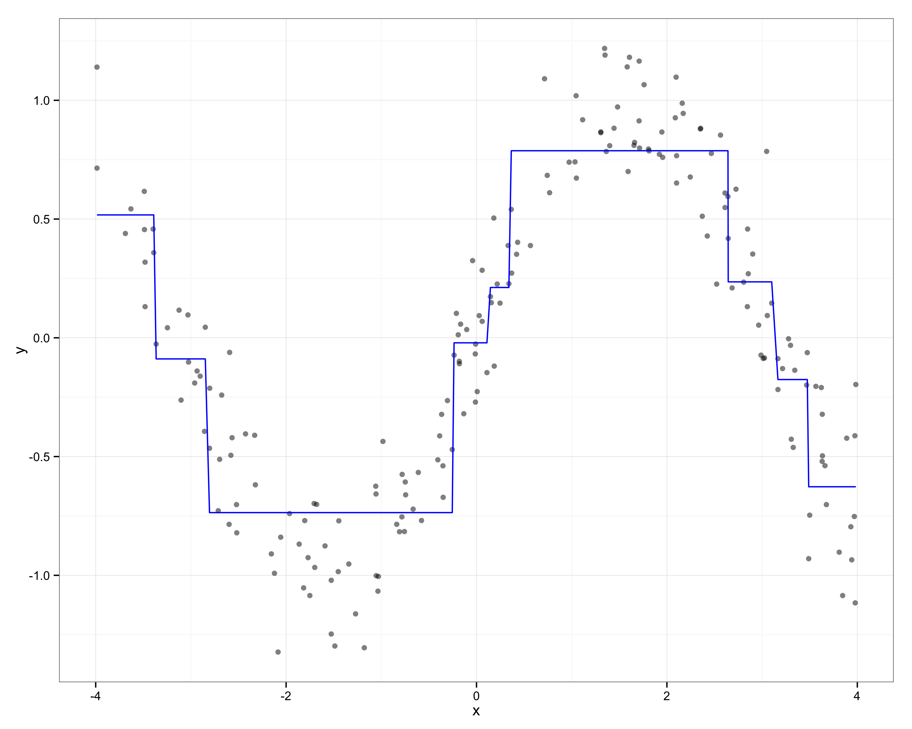

% Random Forests for the Social Sciences
% Zachary Jones and Fridolin Linder[^contact]

[^contact]: Zachary M. Jones is a Ph.D. student in political science at Pennsylvania State University ([zmj@zmjones.com](mailto:zmj@zmjones.com)). Fridolin Linder is a Ph.D. student in political science at Pennsylvania State University ([fridolin.linder@gmail.com](mailto:fridolin.linder@gmail.com)).

\begin{abstract}
We introduce random forests, a nonparametric supervised learning algorithm that allows researchers to nonparametrically describe the relationship between an outcome that is continuous, categorical, or censored (survival). Random forests detect interaction and nonlinearity without prespecification, have low generalization error, do not overfit, and can be used with many correlated predictors. Importantly, they can be interpreted in a substantively relevant way via measures of marginal variable importance and the partial dependence algorithm. We provide intuition as well as technical detail about how random forests work, in theory and in practice, as well as an empirical example from the literature on comparative politics. We also provide software to facilitate the substantive interpretation of random forests and guidance on when random forests may be useful.
\end{abstract}

## Introduction

Political scientists have, in recent years, begun to utilize more flexible algorithmic methods for inferring substantive relationships from data [@beck1998beyond; @beck2000improving; @hainmueller2013kernel; @hill2014empirical]. These methods can often outperform more commonly used regression methods at predicting data not used to fit the model, which is useful for policymakers and serves as a useful check of the explanatory power of our theories [@hill2014empirical]. Many of these methods are commonly thought of as "black box," that is, they predict well, but do not permit substantive interpretation [@breiman2001statistical]. We show that this is *not* the case with a broadly applicable, powerful, and underappreciated method (in political science): random forests [@breiman2001random]. Random forests are especially useful to political scientists because of their ability to approximate arbitrary functional forms, be used with continuous, discrete, and censored (survival) outcomes, and because they permit substantive interpretation via permutation importance measures and the partial dependence algorithm. We provide an introduction to the theory and use of random forests, a substantive example drawn from the literature on comparative politics, and provide software to make substantive interpretation of random forests easy.

We think that random forests would be useful in political science when relevant theory says little about the functional form of the relationship of interest, when the magnitude and degree of nonlinearity and interaction is unknown, when the number of possibly relevant predictors is large, and when prediction is important. Random forests can approximate many nonmonotone, nonlinear functional forms. Interactions and nonlinearities are identified by random forests without prespecification, which decreases prediction error and allows researchers to study the relationships discovered by the algorithm. Random forests allow the inclusion of more predictors than observations. Though this situation is not common in political science (though see the literature on behavioral genetics, wherein this problem does occur), related issues such as a highly correlated predictors are not an issue for random forests. Prediction is important for theory evaluation and for policymakers, and random forests' predictive performance relative to common parametric regression methods and other nonparametric methods is strong.

Random forests are composed of classification and regression trees (CART). A CART is created by recursive partitioning, which is a method for finding homogeneous (in the outcome variable) subsets of the data using the predictors [@breiman1984classification]. Different definitions of homogeneity allow CART to be used with different types of outcomes. The fitted values of CART have low bias but high variance. Random forests were developed to solve this problem via two mechanisms. First, growing multiple decision trees with bootstrap samples of the data and then averaging over the predictions made by each tree: a procedure known as "bagging," and second, randomly selecting a subset of the predictors at each possible split in each CART. The random selection of predictors at each node allows variables that have a weak or variable relationship with the outcome to have an influence on the fitted values. Together bagging and the random selection of predictors at each node substantially decreases the variance of predictions at the cost of a small increase in bias (of the fitted values).

Since CART is central to the understanding of random forests we explain it in detail in the first section. We then discuss random forests, variations on random forests, and methods for extracting substantively relevant information from them. We then apply these methods to an empirical example using data on state repression. Finally we conclude with directions for future research and areas where these methods might be fruitfully applied.

## Classification and Regression Trees

Classification and regression trees (CART) are a regression method that relies on repeated partitioning of the data to estimate the conditional distribution of a response given a set of predictors. Let the outcome of interest be a vector of observations $\mathbf{y} = (y_1,\ldots,y_n)^T$ and the set of explanatory variables or predictors a matrix $\mathbf{X} = (\mathbf{x}_1,\ldots,\mathbf{x}_p)$, where $\mathbf{x}_j = (x_{1j},\ldots,x_{nj})^T$ for $j \in \{1,\ldots,p\}$. The goal of the algorithm is, to partition $\mathbf{y}$ conditional on the values of $\mathbf{X}$ in such a way that the resulting subgroups of $\mathbf{y}$ are as homogeneous as possible.

The algorithm works by considering every unique value in each predictor as a candidate for a binary split, and calculating the homogeneity of the subgroups of the outcome variable that would result by grouping observations that fall on either side of this value. Consider the (artificial) example in Figure \ref{fig:cart_visu}. $\mathbf{y}$ is the vote choice of $n = 40$ subjects (18 republicans and 22 democrats), $\mathbf{x}_1$ is the ideology of the voter and $\mathbf{x}_2$ is the age. 

The goal of the algorithm is to find homogeneous partitions of $\mathbf{y}$ given the predictors. The algorithm starts at the upper right panel of Figure \ref{fig:cart_visu}, the complete data is the first node of the tree. We could classify all cases as Democrats yielding a misclassification rate of $18/40 = 0.45$. But it is obvious that there is some relationship between ideology and vote choice (the D's are mostly on the right side and the R's mostly on the left side), so we could do better in terms of classification error using this information. Formally the algorithm searches through all unique values of both predictors and calculates the number of cases that would be misclassified if a split would be made at that value and all cases on the left and right of this split are classified according to the majority rule. The upper right panel displays this step for one value of ideology (which also turns out to be the best possible split). In the tree in the lower left panel of Figure \ref{fig:cart_visu} the split is indicated by the two branches growing out of the first node. The variable name in the node indicates that the split was made on ideology. To the left of an ideology value of $3.31$ most of the subjects voted Republican and on the right most voted Democrat. Therefore we classify all cases on the left and right as Republican and Democrat respectively (indicated by the shaded areas in the scatterplots). Now only 8 cases are misclassified, yielding an error rate of $8/40 = 0.2$.

![Visualization of a recursive partitioning algorithm for classification. The upper left panel displays the original data. The two panels on the right display the partitions of the original data after the first and the second split respectively. The lower left panel displays the corresponding decision tree. The blue and red shaded areas in the right panels indicate the value for the fitted value of the terminal node. The shading of the area visualizes classification as Republican (red) or Democrat (blue) by majority rule. The red colored letters indicate incorrect classifications under this rule. \label{fig:cart_visu}](figures/cart.png)

The algorithm then looks for further splits within the two new partitions (left and right of $c_{x_1} = 3.21$. It turns out that for the right side there is no split that decreases the misclassification rate sufficiently (we talk about the criteria for making stopping decisions later). This is shown in the tree as a so called terminal node on the right branch of the ideology split. The plot in the terminal node displays the distribution of cases in this partition of the data. 

However, age still contains information to improve the partitioning. At the second node (i.e. all data that falls left of the first split), when splitting the data into subjects older or younger then 51 years, we can obtain a completely homogeneous partition where all subjects voted Republican. Additionally those subjects older then $51$ and with an ideology value lower than $3.21$ are now classified as democrats. Note that the four democratic cases in this region of the data, which were misclassified before, are now correctly classified. The three republicans in the upper right partition are now misclassified. The classification error has therefore been reduced from $8/40$ to $6/40$.

We now extend the logic of CART from this very simple example of binary classification with two continuous predictors to other types of outcome variables. When extending the algorithm to other types of outcome variables we have to think about loss functions explicitly. In fact, we used a loss function in the illustration above. We calculated the classification error when just using the modal category of the outcome variable and argued that further splits of the data are justified because they decrease this error. More formally let $\mathbf{y}^{(m)} = (y^{(m)}_1,\ldots, y^{(m)}_{n^{(m)}})$ and $\mathbf{X}^{(m)} = (\mathbf{x}^{(m)}_1,\ldots,\mathbf{x}^{(m)}_p)$ be the data at the current node $m$, $\mathbf{x}^{(m)}_s$ the predictor that is to be used for a split, with unique values $\mathcal{C}^{(m)} = \{x^{(m)}_i\}_{i\in \{1,\ldots,n^{(m)}\}}$ and $c \in \mathcal{C}^{(m)}$ the value considered for a split. Then the data in the daughter nodes resulting from a split in c are $\mathbf{y}^{(m_l)}$ and $\mathbf{y}^{(m_r)}$. Where $\mathbf{y}^{(m_l)}$ contains all elements of $\mathbf{y}^{(m)}$ whose corresponding values of $\mathbf{x}^{(m)}_s \leq c$ and $\mathbf{y}^{(m_r)}$ all elements where $\mathbf{x}^{(m)}_s > c$. The gain (or reduction in error) from a split at node $m$ in predictor $\mathbf{x}_s$ at value $c$ is defined as:

$$\Delta^{(m)}(\mathbf{y}^{(m)}) = L(\mathbf{y}^{(m)}) - \left[\frac{n^{(m_l)}}{n^{(m)}} L(\mathbf{y}^{(m_l)}) +  \frac{n^{(m_r)}}{n^{(m)}} L(\mathbf{y}^{(m_r)})\right]$$.

Where $n^{(m_l)}$ and $n^{(m_r)}$ are the number of cases that fall to the right and to the left of the split, and $L(\cdot)$ is the loss function. 

In the example above we made the intuitive choice to use the number of cases incorrectly classified when assigning the mode as the fitted value, divided by the number of cases in the node, as the loss function. This proportion can also be interpreted as the impurity of the data in the node, to return to our goal stated at the beginning: to partition the data in a way that produces homogeneous subgroups. Therefore it is intuitive to use the amount of impurity as a measure of loss. This is how the algorithm can be used for outcomes with more than two unique values (i.e. for nominal or ordinal outcomes with more than two categories, or continuous outcomes). By choosing a loss function that is appropriate to measure the impurity of a variable at a certain level of measurement, the algorithm can be extended to those outcomes.

For categorical outcomes, denote the set of unique categories of $\mathbf{y}^{(m)}$ as $\mathcal{D}^{(m)} = \{y^{(m)}_i\}_{i\in\{1,\ldots,n^{(m)}\}}$. In order to asses the impurity of the node we first calculate the proportion of cases pertaining to each class $d \in \mathcal{D}^{(m)}$ and denote it as $p^{(m)}(d)$. Denote further the class that occurs most frequent as $\hat{y}^{(m)} = \max[p^{(m)}(d)]$. Then the loss function can be applied to obtain the impurity of the node. The familiar misclassification loss is obtained from:

$$L_d^{(m)}(\mathbf{y}^{(m)}) = \frac{1}{n^{(m)}} \sum_{i=1}^{n^{(m)}} \mathbb{I}(y^{(m)}_i \neq \hat{y}^{(m)}) = 1 - p^{(m)}(\hat{y}^{(m)})$$.

Where $\mathbb{I}(\cdot)$ is the indicator function that is equal to one when its argument is true. This formalizes the intuition used above: the impurity of the node is the proportion of cases that would be misclassified under "majority rule."[^loss]

[^loss]: The other two loss functions that are most often used are the Gini loss $L_{\text{gini}}(\mathbf{y}^{(m)}) = \sum_{d \in \mathcal{D}^{(m)}} p^{(m)}(d)[1-p^{(m)}(d)]$, and the entropy of the node $L_{\text{ent}}(\mathbf{y}^{(m)}) = -\sum_{d \in \mathcal{D}^{(m)}} p^{(m)}(d)\log[p^{(m)}(d)]$. Extensive theoretical [e.g. @raileanu2004theoretical] and empirical [e.g. @mingers1989empirical] work in the machine learning literature concluded that the choice between those measures does not have a significant impact on the results of the algorithm.

In the continuous case, the fitted value in a node is not calculated by majority vote. Typically the mean of the observations in that node is used as the predicted value for the observations in that node. To measure the impurity of the node usually the mean squared error (MSE) is used: $\hat{y}^{(m)} = \bar{y}^{(m)}$, where $\bar{y}^{(m)}$ is the mean of the observations in $\mathbf{y}^{(m)}$.[^survival]

$$L_{\text{mse}}(\mathbf{y}^{(m)}) = \sum_{i=1}^{n^{(m)}} (y^{(m)}_i - \hat{y}^{(m)})^2$$.

[^survival]: This algorithm can also be applied to censored data. See @ishwaran2008random and @hothorn2006survival for details.

The extension to ordered discrete predictors is straightforward. Since the observed values of a continuous random variable are discrete, the partitioning algorithm described above works in the same way for ordered discrete random variables. Unorderd categorical variables are handled differently. If a split in category $c$ of an unordered discrete variable is considered, the categorization in values to the left and to the right of $c$ has no meaning since there is no ordering to make sense of "left" and "right." Therefore all possible combinations of the elements of $\mathcal{D}^{(m)}$ that could be chosen for a split are considered. This can lead to problems for variables with many categories. For an ordered discrete variable the number of splits that the algorithm has to consider is $|\mathcal{D}^{(m)}|-2$, however, for an unordered variable it is $2^{|\mathcal{D}^{(m)}|-1}-1$. This number gets large very quickly. For example the inclusion of a country indicator might be prohibitive if there are more than a handful of countries (e.g. if there are 21 countries in the sample the number of splits that have to be considered for that variable at each node is more than a million). Solutions to that problem are to include a binary variable for each category or to randomly draw a subset of categories at each node [See @louppe2014understanding for details of the latter method].

After a loss function is chosen, the algorithm proceeds as described in our example. At each node $m$, $\Delta^{(m)}_c(\mathbf{x}_s)$ is calculated for all variables and all possible splits in the variables. The variable-split combination that produces the highest $\Delta$ is selected and the process is repeated for the data in the resulting daughter nodes $\mathbf{y}^{(m_l)}$ and $\mathbf{y}^{(m_r)}$ until a stopping criteria is met. The stopping criteria may be that the tree has reached sufficient depth, that the number of observations that fall into the daughter nodes is too small, or the distribution of $\mathbf{y}^{(m)}$ is sufficiently homogeneous. These stopping criteria are arbitrary and should be understood as tuning parameters, that is, they should be be chosen to minimize the expected generalization error. The longer partitioning continues, the smaller the resulting terminal nodes. That is, the resulting model is more tailored to the data. The result is the possibility of overfitting, resulting in higher generalization error. A predicted value for each observation is obtained, as in our example, by assigning a summary statistic for the terminal node the observation ended up in. For continuous data usually the mean of the distribution in the terminal node is used. For categorical data, either the majority category, or a vector of predicted probabilities for each category is assigned. Figure \ref{fig:cart_approx} illustrates how the predicted values from CART can approximate the function connecting the outcome and the predictor. 

After a tree has been "grown" on the data, predicted values for new data can be obtained in a straightforward manner. Starting at the first node of the tree, a new observation $i$ is "dropped down the tree", according to its values of the predictors $(x_{i1},...,x_{ip})$. That is, at each node, the observation is either dropped to the right or the left daughter node depending on its value on the predictor that was used to make a split at that node. This way, each new observation ends up in on terminal node. Then the predicted value of this terminal node is assigned as the prediction of the tree for observation $i$.

As previously mentioned CART has two main problems: fitted values have high variance and there is a substantial risk of overfitting. Fitted values can be unstable, producing different classifications when changes to the data used to fit the model are made (i.e., the estimator has high variance). There are several related reasons why this occurs. The first is that CART is locally optimal, that is, each split is optimal only at the node at which it occurs. Globally optimal partitioning is generally computationally intractable. Instead heuristic algorithms that are locally optimal (greedy) are used.[^global] Given this locally optimal optimizaton, order effects result, that is, the order in which the variables are split can result in different resulting tree structures, and thus, different predictions. Random forests, which we discuss in the next section, have much lower variance and remove the effects of ordering.

[^global]: Though see @grubingerevtree for an example of a stochastic search algorithm for this problem.

## Random Forests

@breiman1996bagging proposed bootstrap aggregating, commonly called "bagging," to decrease the variance of fitted values from CART. This innovation also can be used to reduce the risk of overfitting. A set of bootstrap samples are drawn from the data: samples drawn with replacement and of the same size as the original data. A CART is fit to each of these bootrap samples. For each bootstrap sample there is some portion of the original data that is *not* in said bootstrap sample, which is commonly referred to as the out-of-bag (OOB) data. Each tree makes predictions for the OOB data by dropping it down the tree that was grown to the data in its bootstrap sample. Thus each observation will have a prediction made by each tree where it was not in the bootstrap sample drawn for that tree. The predicted values for each observation are combined to produce an ensemble estimate which has a lower variance than would a prediction made by a single CART grown on the original data. For continuous outcomes the predictions made by each tree are averaged. For discrete outcomes the majority class is used. Relying on the OOB data for predictions also eliminates the risk of overfitting since the each tree's prediction is made with data not used for fitting.

@breiman2001random extended the logic of bagging to predictors, resulting in random forests. Instead of choosing from all predictors for the split at each node, only a random subset of the predictors are used: increasing the diversity of splits across trees, which allows weaker predictors to have an opportunity to influence the models' predictions. This results in a further decrease in the variance of the fitted values (beyond bagging observations) and allows the use of large numbers of potentially relevant predictors (many more predictors than observations in some cases). A particular observation can fall in the terminal nodes of many trees in the forest, each of which, potentially, can give a different prediction. Again the OOB data, that is, data that was *not* drawn in the bootstrap sample used to fit a particular tree, is used to make each tree's prediction. For continuous outcomes, the prediction of the forest is then the average of the predictions of each tree:

$$\hat{f}(\mathbf{X}) = \frac{1}{T} \sum_{t=1}^T f^{(t)}(\mathbf{X}_{i \in \bar{\mathcal{B}}^{(t)}})$$

where $T$ is the total number of trees in the forest, and $f^{(t)}(\cdot)$ is the $t$'th tree, $\bar{\mathcal{B}}^{(t)}$ is the out-of-bag data for the $t$'th tree, that is, observations in $\mathbf{X}^{(t)}$ and not in $\mathcal{B}^{(t)}$, the bootstrap sample for the $t$'th tree. For discrete outcomes, the prediction is the majority prediction from all trees that have been grown without the respective observation. Figure \ref{fig:rf_approx} displays the approximation to a function relating a continuous outcome to a single predictor obtained from a random selection of 25 trees from a random forest. It can be observed that the approximation is much smoother compared to the approximation by a single tree (see \ref{fig:cart_approx}).

The number of candidate predictors available at each node is a tuning parameter and should be chosen to minimize expected generalization error. Random forests compare favorably with other popular nonparametric methods in prediction tasks and can be interpreted substantively as well [See e.g., @breiman2001random; @breiman2001statistical; @cutler2007random; @murphy2012machine; @hastie2009elements].

Random forests are not without issue however. The CART which they are composed of often rely on biased splitting criteria: some types of variables, specifically variables with many unique values, are artificially preferred to variables with fewer categories, which has effects on measures of variable importance which are one of the ways random forests are interpreted substantively [@hothorn2006unbiased; @strobl2007bias]. Recent developments have resulted in unbiased recursive partitioning algorithms that separate the variable selection and split selection parts of the CART algorithm, and utilize subsampling rather than bootstrapping [@hothorn2006unbiased].

### Substantive Interpretation

Since, with random forests both predictors and observations are being sampled, no particular tree will give great insight into the model's overall prediction for each observation. There are, however, several ways to extract substantive insight from random forests. The most simple is partial dependence [@hastie2009elements]. The partial dependence algorithm works as follows:

 1. Let $\mathbf{x}_j$ be the predictor of interest, $\mathbf{X}_{-j}$ be the other predictors, $\mathbf{y}$ be the outcome, and $\hat{f}(\mathbf{X})$ the fitted forest.
 2. For $\mathbf{x}_j$ sort the unique values $\mathcal{V} = \{\mathbf{x}_j\}_{i \in \{1, \ldots, n\}}$ resulting in $\mathcal{V}^*$, where $|\mathcal{V}^*|=K$. Create $K$ new matrices $\mathbf{X}^{(k)} = (\mathbf{x}_j = \mathcal{V}^*_k, \mathbf{X}_{-j}), \: \forall \, k = (1, \ldots, K)$.
 3. Drop each of the $K$ new datasets, $\mathbf{X}^{(k)}$ down the fitted forest 
 resulting in a predicted value for each observation in all $k$ datasets: $\hat{\mathbf{y}}^{(k)} = \hat{f}(\mathbf{X}^{(k)}), \: \forall \, k = (1, \ldots, K)$.
 4. Average the predictions in each of the $K$ datasets, $\hat{y}_k^* = \frac{1}{n}\sum_{i=1}^N \hat{y}_i^{(k)}, \: \forall \, k = (1, \ldots, K)$.
 5. Visualize the relationship by plotting $\mathbf{V}^*$ against $\hat{\mathbf{y}}^*$.

With slight modification, this method can also be used to visualize any joint relationships (i.e. interactions) the algorithm may have found. To do this create a dataset for each of the possible combinations of unique values of the explanatory variables of interest, predict the outcome in each of these observations, and then find the mean or modal prediction for each of these unique value combinations. For computational reasons we do not always use every unique value when an explanatory variable takes on more an arbitrary number of unique values. In this paper we use a random sample of 24 unique values that $\mathbf{x}_j$ takes on.[^extrapolation] This logic can be generalized to joint relationships of an arbitrary dimension, but we limit ourselves here to pairwise partial dependence. The interpretation of partial dependence: the average predicted value for a particular value of an explanatory variable averaged within the joint values of the other predictors, is intuitive.

[^extrapolation]: It is also possible to use an evenly spaced grid, however, this may result in extrapolation. Both of these options are implemented in our R package [edarf](https://github.com/zmjones/edarf/).

Another approach to extracting information from random forests relies on permutation tests for variable importance. Rather than attempting to characterize the partial dependence of one or more predictors on the response, the goal is instead to describe how the model's ability to predict $y$ depends on a particular predictor. If a particular column of $\mathbf{X}$, say $\mathbf{x}_j$, is unrelated to $\mathbf{y}$, then randomly permuting $\mathbf{x}_j$ within $\mathbf{X}$ should not meaningfully decrease the model's ability to predict $\mathbf{y}$. However, if $\mathbf{x}_j$ is strongly related to $\mathbf{y}$, then permuting its values will produce a systematic decrease in the model's ability to predict $\mathbf{y}$, and the stronger the relationship between $\mathbf{x}_j$ and $\mathbf{y}$, the larger this decrease. Averaging the amount of change in the fitted values from permuting $\mathbf{x}_j$ across all the trees in the forest gives the marginal permutation importance of a predictor.[^marginal] Formally, for classification, the importance of explanatory variable $\mathbf{x}_j$ in tree $t \in T$ is:

$$\text{VI}^{(t)}(\mathbf{x}_j) = \frac{\sum_{i \in \bar{\mathcal{B}}^{(t)}} \mathbb{I}(y_i = \hat{y}_i^{(t)})}{|\bar{\mathcal{B}}^{(t)}|} -
\frac{\sum_{i \in \bar{\mathcal{B}}^{(t)}} \mathbb{I}(y_i = \hat{y}_{i \pi j}^{(t)})}{|\bar{\mathcal{B}}^{(t)}|}
$$
$$\text{VI}(\mathbf{x}_j) = \frac{1}{T} \sum_{t=1}^T \text{VI}^{(t)}(\mathbf{x}_j)$$

where $\bar{\mathcal{B}}$ is the out-of-bag data for tree $t$, $\mathbf{x}_j$ is a particular predictor, $\hat{y}_i^{(t)}$ is the fitted value for observation $i$ in tree $t$, $\hat{y}_{i \pi j}^{(t)}$ is the predicted class for the $i$'th observation after permuting $\mathbf{x}_j$, and $|\bar{\mathcal{B}}^{(t)}|$ is the number of observations *not* in the bootstrap sample used for fitting tree $t$. The importance of variable $\mathbf{x}_j$ in tree $t$ is averaged across all trees to give the permutation importance for the forest [@breiman2001random; @strobl2008conditional]. This can be thought of as testing the null hypothesis of independence between $\mathbf{x}_i$ and $\mathbf{y}$ as well as all other explanatory variables $\mathbf{X}_{-j}$. That is, $\mathbb{P}(\mathbf{y}, \mathbf{x}_j, \mathbf{X}_{-j}) = \mathbb{P}(\mathbf{x}_j)\mathbb{P}(\mathbf{y}, \mathbf{X}_{-j})$. For regression, the permutation is defined similarly, by the average increase in the mean squared error across trees that results from permuting $\mathbf{x}_j$.

[^marginal]: This measure is not truly marginal since the importance of a variable within a particular tree is conditional on all previous splits in the tree. It is possible to conduct a conditional permutation test which permutes $\mathbf{x}_j$ with variables related to $\mathbf{x}_j$ "held constant," reducing the possibility that a variable is deemed important when it is actually spurious [@strobl2008conditional]. However, this procedure is prohibitively costly in terms of computational resources.

### Dependent Data

As previously mentioned, these methods are not designed for use with dependent data, such as is common in political science. Not modeling the dependence structure may decrease predictive performance on new data and mislead us about the importance of variables strongly related to different features of the unmodeled dependence structure. In its basic implementation the estimated regression function is the result of complete pooling of the data. There are several ways this dependence can be modeled. One way is to include a categorical variable with unit indicators as an explanatory variable. Then, this explanatory variable has a chance of being included in the set of variables that the algorithm may select for splitting at a particular node. This is computationally intensive and not always possible. Alternatively, a random effects approach could be used: the outcome of interest is treated as a function of an unknown regression function, which is estimated using random forests and completely pools the data, and set of unit random effects for which we estimate the variance, and idiosyncratic error which is assumed uncorrelated with the random effects [@hajjem2014mixed; @hajjem2011mixed]. Alternative approaches include sampling units [@adler2011ensemble] or sampling units and then an observation from within that unit [@adler2011ensemble]. Alternatively, the analyst can transform the dependent variable, such as by subtracting the within-unit mean. This, however, invalidates the use of the fitted random forest for the prediction of new data. In the following applications we discuss what approach we use and leave the development of other approaches to future work.

### Missingness

Missing values are a perennial problem in real world data. Often missingness is ignored, which, at best, decreases the precision of estimates of model parameters, and at worst biases them. Multiple imputation is frequently used to provide estimates of the values of missing values: this relies on the assumption that, conditional on the observed covariates, missingness is random [@rubin2004multiple; @honaker2010missing]. When analysis is exploratory or predictive, missingness has a different epistemological status and can be *useful* [@shmueli2010explain]. When the goal is prediction alone, informative missingness improves our ability to predict the outcome, and when doing exploration, understanding how missingness is informative can be useful for future work. When predictors with missingness are categorical missingness can simply be recoded as an additional category. However, with continuous variables this is not possible nor is it always desireable in the categorical case. When using permutation importance to measure the degree to which a model's fit is degraded by permuting said variable recoding in this way conflates missingness that is informative with how informative the observed values are. An alternative would be to create a set of variables that indicate whether missingness in a particular predictor (or set of predictors) is present. This does not fix the problem of partially observed predictors, but this can be handled using multiple imputation or other ways to handle missing values such as surrogate splitting, which, since unbiased estimation of causal effects is not the goal, do not have to satisfy the stringent conditionally missing at random assumption previously mentioned. Frequently data are imputed once, and the data are treated as completely observed. This does however, result in a tendency to underestimate generalization error.

## State Repression

![The marginal permutation importance of explanatory variables estimated using random forests, using the dynamic latent measure of state repression developed by @fariss2014. The bar shows the mean decrease in mean squared error that results from randomly permuting the independent variable indicated. If the variable is important, permuting its values should systematically *decrease* predictive performance, whereas an unimportant variable should produce no decrease, or a random decrease in mean squared error. The error bars result the $.025$ and $.975$ quantiles of the distribution of this statistic from the repeated draws from the posterior of the latent variable estimated by @fariss2014. \label{fig:hr-imp}](figures/hr_imp.png)

![The partial dependence of the response of year, percentage of the population that is male and aged 15-25, executive constraint and participation competitiveness (from Polity), the natural logarithm of population, a count of the number of INGOs of which a government’s citizens are members measured by @hafner2005human (labeled INGOs), and contract intensive economy (CIE), a measure of life insurance contracting used by @mousseau2008contracting (from @beck2003economic). On the $y$-axis is the dynamic latent measure of repression developed by @fariss2014 and on the $x$-axis the predictor indicated by the above label. Note that the scale of $y$ differs for each sub-plot. The relationship between each predictor and the response is averaged within the joint values of the other predictors conditional on the relationships discovered by the random forest. All values of the explanatory variable for which there are predictions are observed or imputed values. \label{fig:hr-pd}](figures/hr_pd.png)

![The root mean squared error (RMSE) computed using for the training set (1981-1992) and the test set (1993-1999). The RMSE is calculated for each model fit to a random draw (100 in total) from the posterior of the measure of respect for physical integrity due to @fariss2014, and the error bars show the lower .025 and upper .975 quantiles. The point shows the median. The models shown are Least Angle Regression (LARS) [@efron2004least], a basis-expanded Generalized Additive Model regularized via the adaptive least absolute shrinkage and selection operator (LASSO) [@kenkel2013bootstrapped; @tibshirani1996regression], and a random forest [@breiman2001random].
\label{fig:hr-pred}](figures/hr_pred.png)

There is a large literature in political science on the determinants of state repression, especially violations of physical integrity such as killings, disappearances, torture, and political imprisonment. Quantitative analysis of cross-national patterns of state repression relies on annual country reports from Amnesty International and the United States Department of State, which are used to code ordinal measures of state repression such as the Cingranelli and Richards Physical Integrity Index and the Political Terror Scale [@ciri2010; @woodgibney2010]. We use the measure from @fariss2014 which is based on a dynamic measurement model, which aggregates information from multiple sources on state repression in each country-year into a continuous measure.

The literature on state repression has, like most areas of political science, been dominated by data modeling. A particular stochastic model for the data is assumed, and the parameters of the model are estimated using the data on hand. Then statistical inference about the model's parameters is used to support claims about the generality of the results (implicitly about causality or population quantities). It seems unlikely that the assumed model of the data generating process is correctly specified or even a reasonable approximation given the complexity of the dynamics of dissent and repression well known from micro-level quantitative and qualitative research, leaving open the question of what can be learned from estimates of parameters that govern such models absent strong predictive validity. We think that researchers often sell the predictive power of their theories short by making strict assumptions about functional form that are not a part of their theory.

We instead aim to explore the available data, summarizing the relationships between the an expanded set of variables identified in @hill2014empirical as important explanations for state repression in the extant literature and the measure of respect for physical integrity rights from @fariss2014.[^units] We do this using random forests. We present the marginal permutation importance of each variable and the partial dependence of the estimated function on the values of a subset of the explanatory variables as well as a subset of the large set of possible two-dimensional joint dependencies discovered by the model.

[^units]: As discussed in the last paragraph of the sub-section title "[Classification and Regression Trees]" it is not possible to include a categorical variable of country labels in this example. There are 189 countries in the data for this example, resulting in $2^{189-1}-1$ possible splits.

To reiterate, the marginal permutation importance shows the mean decrease in prediction error that results from randomly permuting an explanatory variable. If the variable is an important predictor, permuting its values will result in a systematic increase in prediction error, while an unimportant predictor will result in no decrease or a random decrease in prediction error. Figure \ref{fig:hr-imp} shows the permutation importance of predictors of state repression taken from @hill2014empirical. The rank ordering of the predictor importance is somewhat different from that of the original study, though the set of data used here is somewhat different.

Participation competitiveness, a component of Polity that measures "the extent to
which alternative preferences for policy and leadership can be pursued in the political arena," is the most important predictor according to this measure [@marshallaggers2009]. That is, the prediction error increases a substantial amount (30\%) when it is randomly shuffled. This should not be surprising, since, as noted in @hill2013concept and @hill2014empirical, there is conceptual overlap between this measure and measures of state repression. The natural logarithm of population and GDP per capita, and civil war are unsurprisingly important as well. More interesting are the importance of measures of contract intensive economy (CIE, used by @mousseau2008contracting), rule of law (from the International Country Risk Guide), judicial independence (from @ciri2010), and youth bulges (measured by @urdal2006 and used by @nordas2013), which represent relatively understudied concepts that may be worth further investigation.

The partial dependence plots shown in Figure \ref{fig:hr-pd} indicates that the model discovers a variety of nonlinearity which may be missed by analysts relying on more restrictive data models. These plots show the predicted values of repeated draws of the latent measure of state repression averaged within the values of the other variables included. However it is possible that this "nonlinearity" is due to interactions with other included or excluded explanatory variables, or reflect a pattern due to unmodeled dependence in the data. Since this is EDA this can be investigated, for example by looking at the average fitted value within values of multiple predictors. A plot showing partial dependence for all of the predictors is available in the [Appendix]. The random forest has clearly discovered patterns in the data that do not comport with the assumptions commonly made about the function mapping the predictors to the response in commonly used data models. We suggest that a great deal more value could be extracted from observational data already collected but analyzed with methods that impose structure on the data that is inappropriate. Additionally, the quantities extracted from the model pertain directly to prediction (in the case of permutation importance), or are the result of a fitting process that is primarily concerned with prediction (in the case of partial dependence), which we think makes their application to observational data in political science quite natural.

Lastly we examine how well the model does at predicting latent respect for physical integrity rights. We split the data into two sets: a training set that covers 1981-1992 and a test set that covers 1993-1999. We repeatedly draw from the latent outcome variable's distribution, fit a model to the training set, predict the outcome in the test set, calculate the root mean square error,[^rmse] and then summarize the distribution of these error statistics across a large number of draws from the latent outcome variable using the lower .025 and upper .975 quantiles and the median. Absent intuitive scale for the outcome variable it is hard to judge the model's performance in absolute terms, thus we provide comparisons to other models. One thing to note is that there is an increase in the prediction error over time within the training and test data suggesting that there there is over-time variation in respect for physical integrity rights that we are not able to explain with the included measures. We hope that this provides a useful predictive benchmark for this measure of physical integrity rights.

[^rmse]: $\text{RMSE}(\mathbf{y}, \hat{\mathbf{y}}) = \sqrt{\frac{1}{n}\sum_{i=1}^n (y_i - \hat{y}_i)^2}$.

## Conclusion

In situations where relevant theory says little about the functional form of the relationship of interest, the magnitude and degree of nonlinearity and interaction is unknown, the number of possibly relevant predictors is large, or when prediction is important, random forests may be more useful than a generalized linear model. We believe that this situation is common, especially in comparative politics and international relations.

We have provided a technical introduction to CART and random forests, with the goal of providing researchers with enough background knowledge to use these methods in an informed manner, as well as companion software to reduce the technical burden of their use. Random forests are but one member of a broad class of supervised machine learning methods that could be useful to political scientists. We hoep that in the future these methods and the issues that they are designed to solve are incorporated into political science. Particularly, we see the development of machine learning methods for dependent data as a fruitful area for future research.

# References

# Appendix

