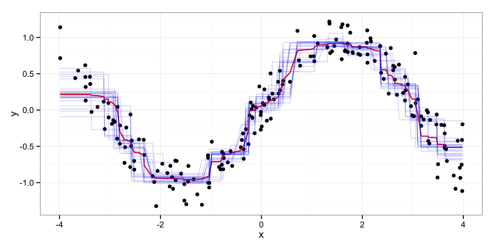
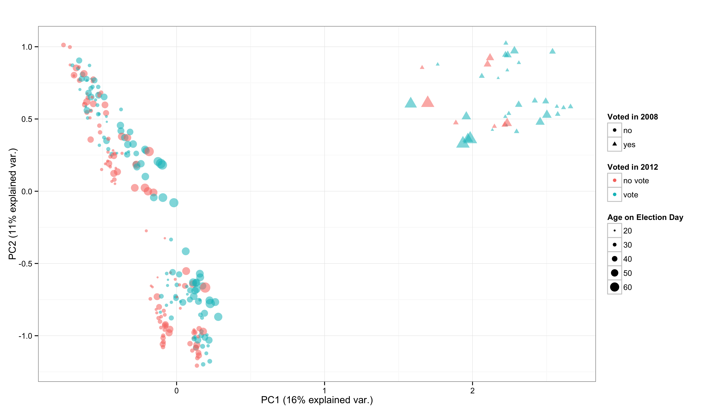

% Exploratory Data Analysis using Random Forests
% Zachary Jones and Fridolin Linder

# Motivation
 - Big Data and other sources of new data revive exploratory data analysis (EDA)
 - Machine learning (ML) is seen as "black box"
 - However, can be very helpful for EDA
 - Flexible, scalable
 - We present Random Forests (RF) as a method for EDA
 - Provide software for EDA with RF: \texttt{edarf}
 - Demonstration with political science examples (Input!)

# Overview
 - Introduction to CART and RF
 - 

# CART (Overview)

$$\mathbf{y} = f(\mathbf{X})$$

 - Non-parametric: No assumptions about the distribution of the outcome variable (only that the true function can be approximated well by composition of piecewise constant functions)
 - Works for continuous and discrete (ordered/unordered) outcomes
 - CART "learns" a piecewise constant approximation to $f(\cdot)$ by finding homogeneous subsets of the data conditional on the predictors
 - Homogeneous subsets are produced by recursively splitting the data into binary partitions, conditional on their values on the predictors
 
# CART (Demonstration)

# Random Forests

 - decision trees are low bias high variance estimators of $\hat{f}(\mathbf{X})$
 - problems with correlated and weak predictors
 - ensembles of decision trees are used to mitigate these problems

  1. bagging (resample data, fit a tree to each replicate, summarise over trees)
  2. random selection of predictors at each split

Bagging combined with random selection of predictors gives random forests

# Random Forest Function Approximation

# Methods for EDA

 - Variable importance: Permutation Importance, Tree Depth
 - Interpreting relationships: Partial Dependence
 - Detecting Interactions: $k$-way Partial Dependence, Depth in Subtrees
 - Clustering: Proximity Matrices (decomposed)

# Example Data

We are looking for better examples!

 - State Repression
   + State repression (static, only 1999) country-year data from Fariss (2014) and Hill and Jones (2014)
 - Ex-fellons turnout
   + Field experiment on ~6000 ex-felons in Connecticut

# Permutation Importance

# Partial Dependence

# Interactions

# Clustering (1)

# Clustering (2)

# Future Development

 - functional ANOVA decomposition of learned $f(\mathbf{X})$ (Hooker 2004, 2007)
    + decrease influence of extrapolation of low dimensional representation of learned $f(\mathbf{X})$
 - interaction detection
    + maximal subtree visualization and computation (Ishwaran et. al. 2011)
    + joint/marginal permutation importance visualization and computation
    + additivity testing (Mentch and Hooker 2014)
 - variance estimation
    + using incomplete U-statistics (Mentch and Hooker 2014)

# Future Research (Dependent Data)

 - Nonparametric bootstraps for dependent data (e.g. Lahiri 2003)
    + application specific but would be nice to have accessible implementations
 - GLME estimation random effects and tree-based estimation of $f(\cdot)$ (e.g., Hajjem 2014)

# Conclusion

 - good general purpose supervised learner (in terms of generalization error)
    + empirically (e.g., Fernandez-Delgado et al. 2014)
    + theoretically (e.g., Wager and Walther 2015)
 - *many* methods for interpretation (compared to many other supervised learners) and `edarf` makes this *much* easier to do
 - relatively easy to explain (in the simplest form)

# Contact and Links

 - Zach ([zmj@zmjones.com](mailto:zmj@zmjones.com))
 - Frido ([fridolin.linder@psu.edu](mailto:fridolin.linder@psu.edu))
 - `edarf` [github.com/zmjones/edarf](http://github.com/zmjones/edarf)
