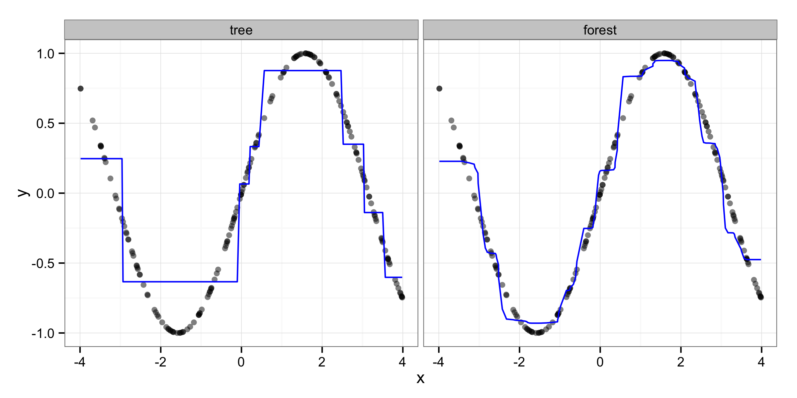

% Random Forests for Exploratory Data Analysis
% Zachary M. Jones and Fridolin Linder

# Motivation
 - describing complex data while maximizing predictive power
 - want to retain ability to interpret substantively
 - exploratory data analysis (EDA) is description of the data
    + when formal conditions for statistical inference are not met
    + when a suitable generative model is not known
	+ to discover patterns in the data
 - algorithmic methods (i.e. machine/statistical learning) that are good for prediction are a great way to do EDA

# CART (1.)

 - piecewise constant approximation to $f(\mathbf{X})$
 - find subsets of the data using the predictors that are homogenous in the outcome variable

# CART (2.)

# CART (3.)

 - 

Gain: $$\Delta^{(m)}_{c}(\mathbf{x}^{(m)}_s) = L(\mathbf{y}^{(m)}) - \left[\frac{n^{(m_l)}}{n^{(m)}} L(\mathbf{y}^{(m_l)}) +  \frac{n^{(m_r)}}{n^{(m)}} L(\mathbf{y}^{(m_r)})\right]$$.

# Ensembles

 - decision trees are low bias high variance estimators of $\hat{\mathbf{y}} = \hat{f}(\mathbf{X})$
   + this is what is meant when bias/variance is discussed in the statistical learning literature
 - ensembles of decision trees are useful when they reduce bias and variance

  1. bagging (resample data and fit a tree to each replicate: reduces variance)
  2. boosting (reweight predictions by negative gradient of loss)
  3. randomization (decorrelate trees by growing them with a random selection of predictors)

(1) combined with (3) when (3) is random selection of predictors at each node in the tree gives random forests

# Random Forests

insert graph of node randomization

# Function Approximation

# Partial Dependence

1. Let $\mathbf{x}_j$ be the predictor of interest, $\mathbf{X}_{-j}$ be the other predictors, $\mathbf{y}$ be the outcome, and $\hat{f}(\mathbf{X})$ the fitted forest.
 2. For $\mathbf{x}_j$ sort the unique values $\mathcal{V} = \{\mathbf{x}_j\}_{i \in \{1, \ldots, n\}}$ resulting in $\mathcal{V}^*$, where $|\mathcal{V}^*|=K$. Create $K$ new matrices $\mathbf{X}^{(k)} = (\mathbf{x}_j = \mathcal{V}^*_k, \mathbf{X}_{-j}), \: \forall \, k = (1, \ldots, K)$.
 3. Drop each of the $K$ new datasets, $\mathbf{X}^{(k)}$ down the fitted forest 
 resulting in a predicted value for each observation in all $k$ datasets: $\hat{\mathbf{y}}^{(k)} = f(\mathbf{X}^{(k)}), \: \forall \, k = (1, \ldots, K)$.
 4. Average the predictions in each of the $K$ datasets, $\hat{y}_k^* = \frac{1}{n}\sum_{i=1}^N \hat{y}_i^{(k)}, \: \forall \, k = (1, \ldots, K)$.
 5. Visualize the relationship by plotting $\mathbf{V}^*$ against $\hat{\mathbf{y}}^*$.

# 

# Permutation Importance

$$\text{VI}^{(t)}(\mathbf{x}_j) = \frac{\sum_{i \in \bar{\mathcal{B}}^{(t)}} \mathbb{I}(y_i = \hat{y}_i^{(t)})}{|\bar{\mathcal{B}}^{(t)}|} -
\frac{\sum_{i \in \bar{\mathcal{B}}^{(t)}} \mathbb{I}(y_i = \hat{y}_{i \pi j}^{(t)})}{|\bar{\mathcal{B}}^{(t)}|}
$$
$$\text{VI}(\mathbf{x}_j) = \frac{1}{T} \sum_{t=1}^T \text{VI}^{(t)}(\mathbf{x}_j)$$

# Example (1.)
 - intro to data

# Example (2.)
 - details

# Example (3.)
 - prediction plot

# Example (4.)
 - partial dependence plots (subset)

# Example (5.)
 - permutation importance plot

# Conclusion
