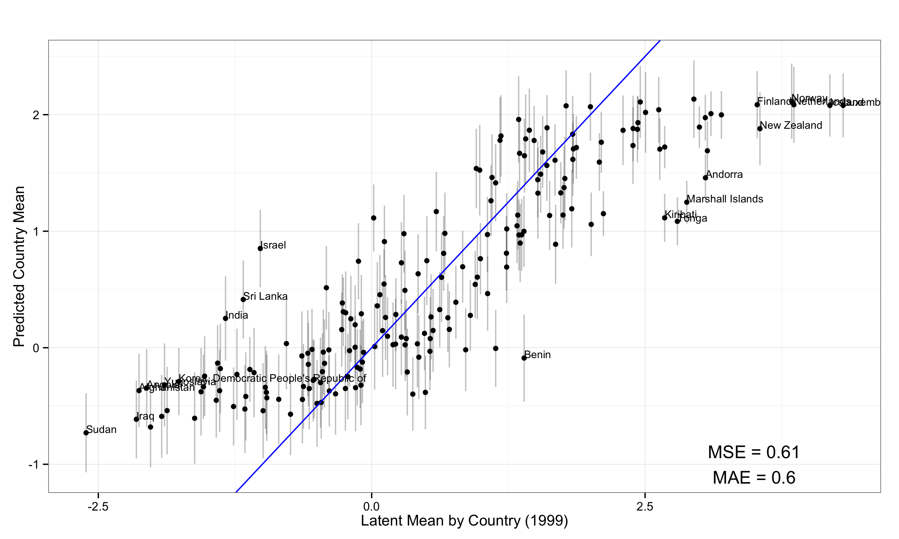
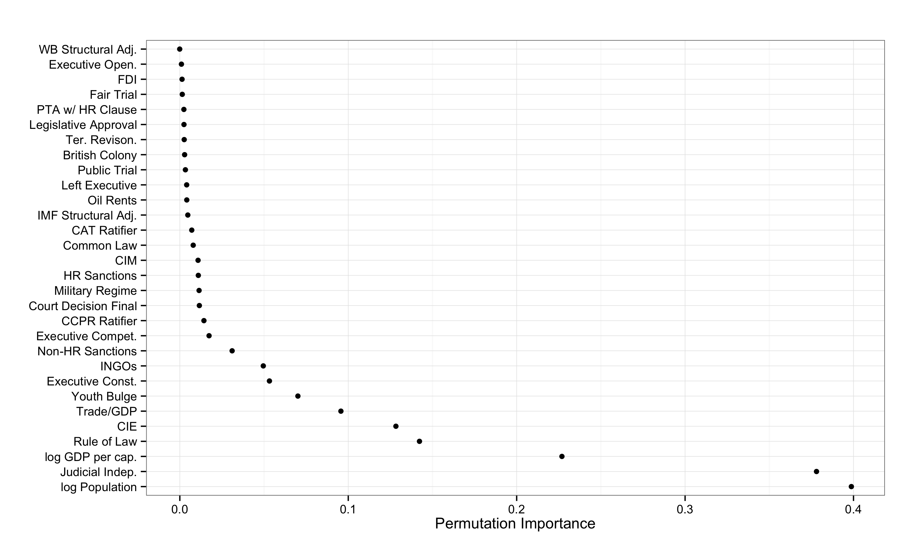
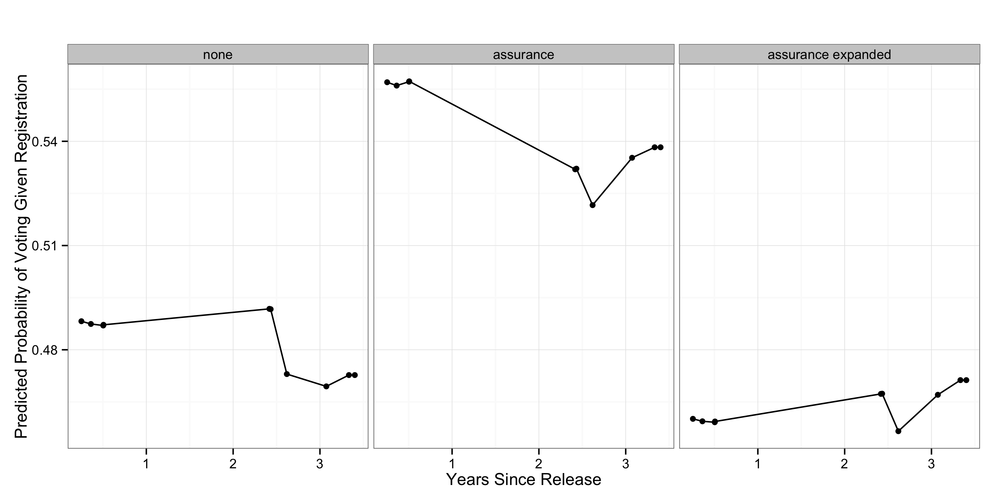

% Exploratory Data Analysis using Random Forest
% Zachary Jones[^zach] and Fridolin Linder[^frido]

[^zach]:[zmj@zmjones.com](mailto:zmj@zmjones.com)
[^frido]:[fridolin.linder@psu.edu](mailto:fridolin.linder@psu.edu)

# Motivation
 
 - Exploratory data analysis is essential to generate hypotheses
 - Rise of ``Big Data'': Lots of data little theory
 - New focus on EDA
 - Machine learning is seen as "black box"

# Contributions

 - We argue: Predictive algorithms can be used for substantive research
 - Introduction to Random Forests for political scientists
 - Collection and exposition of methods for substantive interpretation
 - Developement of an \texttt{R} package (\texttt{edarf}) to make these methods easily accessible

# Classification and Regression Trees (CART)

 - Random Forest is an ensemble of many CART
 - CART "learns" the model by finding homogeneous subsets of the data conditional on the predictors

# Random Forests

- CART have low bias high variance and have problems with correlated and weak predictors
- Random Forest (Breiman 2001) solves the problem through:

  1. bagging (resample data, fit a tree to each replicate, summarize over trees)
  2. random selection of predictors at each split

- Good predictive performance
       + empirically (e.g., Fernandez-Delgado et al. 2014)
       + theoretically (e.g., Wager and Walther 2015)

# Methods for Exploratory Data Analysis

 - Very good for EDA, because:
     + **Flexible**: Detects interactions, nonlinear relationships
     + **Versatile**: All kinds of outcomes, no parametric assumptions, many predictors
     + **Scalable**: Many predictors, parallelizable
 - But, direct interpretation impossible
 - Special methods to extract substantive insights:
     +  **Variable importance**: permutation importance, average depth in trees
     +  Interpreting **relationships**: partial dependence
     +  Detecting **Interactions**: $k$-way partial dependence, depth in Subtrees, marginal vs. joint importance
     +  **Clustering**: proximity matrices

# \texttt{edarf} (**E**xploratory **D**ata **A**nalysis with **R**andom **F**orests)

 - There are three major \texttt{R} packages to fit random forests: \texttt{randomForest}, \texttt{randomForestSRC} and \texttt{party}
 - Methods for interpretation are implemented in some packages, but not consistent across packages
 - No good visualizations (important for EDA)
 - Some methods are not implemented (e.g. uncertainty in predictions + see Future Developement)
 - \texttt{edarf} implements all methods with a common interface and is easily extendable
 - Development version available at: [github.com/zmjones/edarf](http://github.com/zmjones/edarf)

# Example Data

 -  State repression (static, only 1999) country-year data from Fariss (2014) and Hill and Jones (2014)
 -  Field experiment on turnout of ~6000 ex-felons in Connecticut (Gerber et al. 2014)

# Exploration through prediction

# Permutation Importance

- How much does permuting a preditor reduce predictive accuracy?

# Partial Dependence

- Average prediction of the forest for every unique value of a predictor

# Interaction detection: Joint Partial Dependence

# Clustering Example

- How often do two observations end up in the same terminal node?

# Future Development (\texttt{edarf})

 - interaction detection
    + maximal subtree visualization and computation (Ishwaran et. al. 2011)
    + joint/marginal permutation importance visualization and computation
    + additivity testing (Mentch and Hooker 2014)
 - variance estimation
    + using incomplete U-statistics (Mentch and Hooker 2014)
 - functional ANOVA decomposition of learned $f(\mathbf{X})$ (Hooker 2004, 2007)
    + decrease influence of extrapolation of low dimensional representation of learned $f(\mathbf{X})$

# Conclusion

 - Random Forests are a powerful predictive tool that is also suitable for EDA
 - many methods for interpretation (compared to many other supervised learners) and `edarf` makes this much easier to do

# Thank You!

 - Zach ([zmj@zmjones.com](mailto:zmj@zmjones.com))
 - Fridolin ([fridolin.linder@psu.edu](mailto:fridolin.linder@psu.edu))
 - `edarf` [github.com/zmjones/edarf](http://github.com/zmjones/edarf)

# Random Forest

# Partial Dependence Algorithm

Let $\mathbf{x}_j$ be the predictor of interest, $\mathbf{X}_{-j}$ be the other predictors, $\mathbf{y}$ be the outcome, and $\hat{f}(\mathbf{X})$ the fitted forest. Then, in more detail, the partial dependence algorithm works as follows:

 1. For $\mathbf{x}_j$ sort the unique values $\mathcal{V} = \{\mathbf{x}_j\}_{i \in \{1, \ldots, n\}}$ resulting in $\mathcal{V}^*$, where $|\mathcal{V}^*|=K$. Create $K$ new matrices $\mathbf{X}^{(k)} = (\mathbf{x}_j = \mathcal{V}^*_k, \mathbf{X}_{-j}), \: \forall \, k = (1, \ldots, K)$.
 2. Drop each of the $K$ new datasets, $\mathbf{X}^{(k)}$ down the fitted forest 
 resulting in a predicted value for each observation in all $k$ datasets: $\hat{\mathbf{y}}^{(k)} = \hat{f}(\mathbf{X}^{(k)}), \: \forall \, k = (1, \ldots, K)$.
 3. Average the predictions in each of the $K$ datasets, $\hat{y}_k^* = \frac{1}{n}\sum_{i=1}^N \hat{y}_i^{(k)}, \: \forall \, k = (1, \ldots, K)$.
 4. Visualize the relationship by plotting $\mathcal{V}^*$ against $\hat{\mathbf{y}}^*$.

