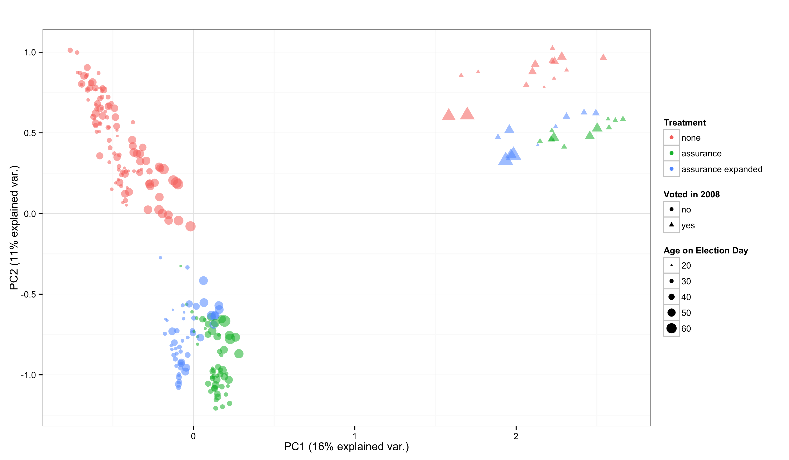

% Exploratory Data Analysis using Random Forests
% Zachary Jones and Fridolin Linder

# Motivation
 - Big Data and other sources of new data revive exploratory data analysis (EDA)
 - Machine learning (ML) is seen as "black box"
 - But can be very helpful, especially when theory is not very developed
 - Random Forests (RF) are a flexible and scalable method -> good for EDA

# Contributions

 - We argue: Predictive algorithms can be used for substantive research (EDA)
 - Introduction to Random Forests for political scientists
 - Collection and exposition of methods for substantive interpretation
 - Developement of an \texttt{R} Package (\texttt{edarf}) to make these methods easily accessible

# Classification and Regression Trees (CART)

 - Random Forest is an ensemble of many CART
 - CART "learns" the model by finding homogeneous subsets of the data conditional on the predictors

# Random Forests

- CART have low bias high variance and have problems with correlated and weak predictors
- Random Forest (Breiman 2001) solves the problem through:

  1. bagging (resample data, fit a tree to each replicate, summarize over trees)
  2. random selection of predictors at each split

# Random Forest

# Methods for Exploratory Data Analysis

 - Very good for EDA, because:
 - **Flexible**: Detects interactions, nonlinear relationships
 - **Versatile**: All kinds of outcomes, no parametric assumptions, many predictors
 - But, direct interpretation impossible
 - Special methods to extract substantive insights:
     +  Variable importance: permutation importance, average tree depth
     +  Interpreting relationships: partial dependence
     +  Detecting Interactions: $k$-way partial dependence, depth in Subtrees, marginal vs. joint importance
     +  Clustering: proximity matrices

# \texttt{edarf}

 - There are three major \texttt{R} packages to fit random forests: \texttt{randomForest}, \texttt{randomForestSRC}, \texttt{party}
 - Methods for interpretation are implemented in some packages, but not consistent across packages
 - No good visualizations (important for EDA)
 - Some newer developments are not integrated (e.g. uncertainty in predictions + see Future Developement)

# Example Data

 - State Repression
   + State repression (static, only 1999) country-year data from Faeries (2014) and Hill and Jones (2014)
 - Ex-felons turnout
   + Field experiment on ~6000 ex-felons in Connecticut

We are looking for better examples!

# Permutation Importance

- Measure: By how much does the predictive accuracy decrease when randomly permuting an explanatory variable $x$

# Permutation Importance Example

# Partial Dependence

 - Average prediction of the Forest for a value of the predictor

 - Algorithm:
    + Set $x$ to one value of $x$ for each observation in data
    + Make a prediction for each observation
    + Average over predictions
    + Repeat for each unique value

# Permutation Importance Example

# Interaction Detection

- Several methods for interaction detection
    + Joint partial dependence
    + Depth in maximal subtrees
    + Marginal vs. Joint variable importance

# Joint Partial Dependence Example

# Clustering

# Clustering Example

# Future Development

 - functional ANOVA decomposition of learned $f(\mathbf{X})$ (Hooker 2004, 2007)
    + decrease influence of extrapolation of low dimensional representation of learned $f(\mathbf{X})$
 - interaction detection
    + maximal subtree visualization and computation (Ishwaran et. al. 2011)
    + joint/marginal permutation importance visualization and computation
    + additivity testing (Mentch and Hooker 2014)
 - variance estimation
    + using incomplete U-statistics (Mentch and Hooker 2014)

# Future Research (Dependent Data)

 - Nonparametric bootstraps for dependent data (e.g. Lahiri 2003)
    + application specific but would be nice to have accessible implementations
 - GLME estimation random effects and tree-based estimation of $f(\cdot)$ (e.g., Hajjem 2014)

# Conclusion

 - good general purpose supervised learner (in terms of generalization error)
    + empirically (e.g., Fernandez-Delgado et al. 2014)
    + theoretically (e.g., Wager and Walther 2015)
 - many methods for interpretation (compared to many other supervised learners) and `edarf` makes this much easier to do

# Contact and Links

 - Zach ([zmj@zmjones.com](mailto:zmj@zmjones.com))
 - Fridolin ([fridolin.linder@psu.edu](mailto:fridolin.linder@psu.edu))
 - `edarf` [github.com/zmjones/edarf](http://github.com/zmjones/edarf)
