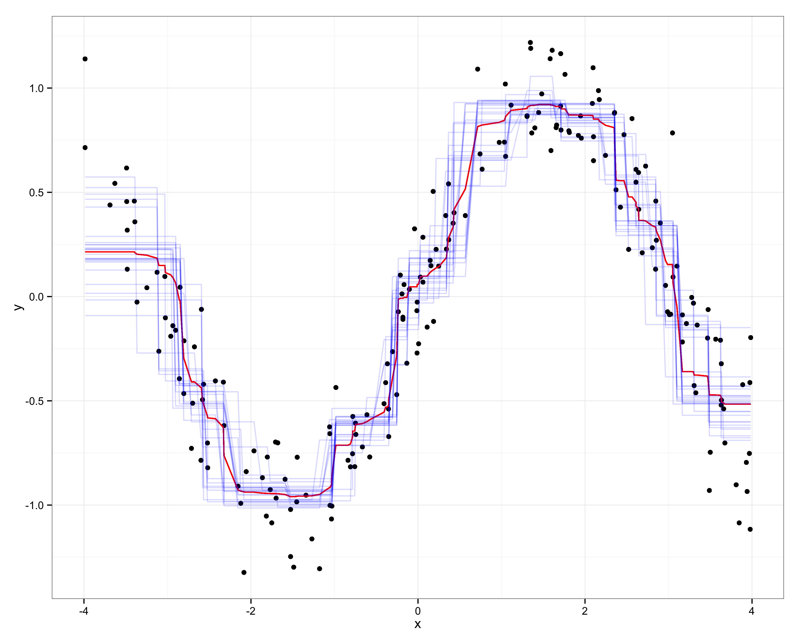

% Exploratory Data Analysis using Random Forests[^conf]
% Zachary Jones and Fridolin Linder[^contact]

[^conf]: Prepared for the 73rd annual MPSA conference, April 16-19, 2015.
[^contact]: Zachary M. Jones is a Ph.D. student in political science at Pennsylvania State University ([zmj@zmjones.com](mailto:zmj@zmjones.com)). Fridolin Linder is a Ph.D. student in political science at Pennsylvania State University ([fridolin.linder@gmail.com](mailto:fridolin.linder@gmail.com)); his work is supported by Pennsylvania State University and the National Science Foundation under an IGERT award \#DGE-1144860, "Big Data Social Science".

# Motivation
 - Big Data and other sources of new data revive exploratory data analysis (EDA)
 - Machine learning (ML) is seen as ``black box''
 - But: Can be very helpful for EDA
 - Flexible, scalable
 - We present Random Forests (RF) as a method for EDA
 - Provide software for EDA with RF: \texttt{edarf}
 - Demonstration with political science examples (Input!)

# Overview
 - Introduction to CART and RF
 - 

# CART (Overview)

$$\mathbf{y} = f(\mathbf{X})$$

 - Non-parametric: No assumptions about the distribution of the outcome variable
 - Works for continuous and discrete (ordered/unordered) outcomes
 - CART "learns" a piecewise approximation to $f(\cdot)$ by finding homogeneous subsets of the data conditional on the predictors
 - Homogeneous subsets are produced by recursively splitting the data into binary partitions, conditional on their values on the predictors
 
# CART (Demonstration)

# Random Forests

 - decision trees are low bias high variance estimators of $\hat{f}(\mathbf{X})$
 - problems with correlated and weak predictors
 - ensembles of decision trees are used to mitigate these problems

  1. bagging (resample data, fit a tree to each replicate, average over trees)
  2. random selection of predictors at each split

Bagging combined with random selection of predictors gives random forests

# Random Forest Function Approximation

# Methods for EDA
 - Variable importance: Permutation Importance, Tree Depth
 - Interpreting relationships: Partial Dependence
 - Detecting Interactions: k-way Partial Dependence, Depth in Subtrees
 - Clustering: Proximity Matrices

# Example Data

 - State Repression
   + State repression (1999) country level data from Fariss (2014)
   + Predictors are a subset of Hill and Jones (2014)
 - Ex-fellons turnout
   + Field experiment on 6000 Connecticut 
 - Work in progress: examples not very well suited

# Permutation Importance

# Partial Dependence

# Interactions

\input{figures/latex_subfloats/interaction.tex}

# Clustering

\input{figures/latex_subfloats/proximity.tex}

# Conclusion

 - positives
    + powerful at prediction tasks
    + intuitive means of substantive interpretation
    + scalable (up and down)

 - negatives
    + no use of dependency structure
	+ statistical theory still being developed
