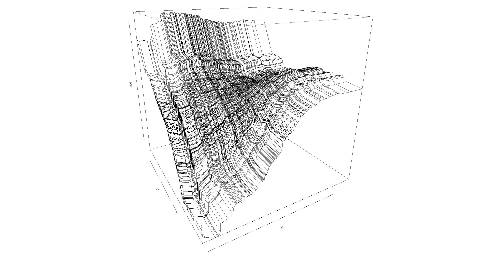

% Random Forests for Exploratory Data Analysis
% Zachary M. Jones and Fridolin Linder

# Motivation
 - describing complex data while maximizing predictive power
 - want to retain ability to interpret substantively
 - exploratory data analysis (EDA) is description of the data
    + when formal conditions for statistical inference are not met
    + when a suitable generative model is not known
	+ to discover patterns in the data
 - algorithmic methods (i.e. machine/statistical learning) that are good for prediction are a great way to do EDA

# CART (Overview)

$$\mathbf{y} = f(\mathbf{X})$$
 - Non-parametric: No assumptions about the distribution of the outcome variable; only that the functional form can be approximated by a piecewise constant function
 - Works for continuous and discrete (ordered/unordered) outcomes
 - CART "learns" a piecewise approximation to $f(\cdot)$ by finding homogeneous subsets of the data conditional on the predictors
 - Homogeneous subsets are produced by recursively splitting the data into binary partitions, conditional on their values on the predictors
 
# CART (Splitting)

- Splitting criterion: minimize "Node Impurity"
- Can be measured in several ways
    + categorical outcomes: Gini index, entropy, missclassification by majority vote
    + continuous outcomes: Variance (equivalent to MSE for piecewise constant functions)
- At each node the split (which predictor and which value) that minimizes the impurity  of the resulting nodes is selected
- Splitting is stopped when a stopping criteria is met: e.g. minimum node size, maximum number of terminal nodes

# CART (Demonstration)

# CART Function Approximation

# Random Forests

 - decision trees are low bias high variance estimators of $\hat{f}(\mathbf{X})$
 - problems with correlated and weak predictors
 - ensembles of decision trees are used to mitigate these problems

  1. bagging (resample data, fit a tree to each replicate, average over trees )
  2. random selection of predictors at each split

Bagging combined with random selection of predictors gives random forests

# Random Forests

# Random Forest Function Approximation

# Example Data

 - State repression (1981-1999) country-year from a dynamic measurement model in Fariss (2014)
    + higher numbers mean more respect for physical integrity rights
 - Predictors are a subset of Hill and Jones (2014)
 - Substantial non-ignorable missingness handled via surrogate splitting (ignored w/o dropping)
 - Data are naively resampled (.632 subsamples) for growing trees

# Prediction

# Permutation Importance

How much would generalization error increase if we didn't know about $\mathbf{x}_j$?

$$\text{VI}^{(t)}(\mathbf{x}_j) = \frac{\sum_{i \in \bar{\mathcal{B}}^{(t)}} L(y_i, \hat{y}_i^{(t)})}{|\bar{\mathcal{B}}^{(t)}|} -
\frac{\sum_{i \in \bar{\mathcal{B}}^{(t)}} L(y_i,\hat{y}_{i \pi j}^{(t)})}{|\bar{\mathcal{B}}^{(t)}|}
$$
$$\text{VI}(\mathbf{x}_j) = \frac{1}{T} \sum_{t=1}^T \text{VI}^{(t)}(\mathbf{x}_j)$$

Where $L(\cdot)$ is a loss function such as $\mathbb{I}(y_i = \hat{y}_i)$ or $(y_i - \hat{y}_i)^2$.

# Permutation Importance Example

# Partial Dependence

1. Let $\mathbf{x}_j$ be the predictor of interest, $\mathbf{X}_{-j}$ be the other predictors, $\mathbf{y}$ be the outcome, and $\hat{f}(\mathbf{X})$ the fitted forest.
 2. For $\mathbf{x}_j$ sort the unique values $\mathcal{V} = \{\mathbf{x}_j\}$ resulting in $\mathcal{V}^*$, where $|\mathcal{V}^*|=K$. Create $K$ new matrices $\mathbf{X}^{(k)} = (\mathbf{x}_j = \mathcal{V}^*_k, \mathbf{X}_{-j})$.
 3. Drop each of the $K$ new datasets, $\mathbf{X}^{(k)}$ down the fitted forest 
 resulting in a predicted value for each observation in all $k$ datasets: $\hat{\mathbf{y}}^{(k)} = f(\mathbf{X}^{(k)})$.
 4. Average the predictions in each of the $K$ datasets, $\hat{y}_k^* = \frac{1}{n}\sum_{i=1}^N \hat{y}_i^{(k)}$.
 5. Visualize the relationship by plotting $\mathbf{V}^*$ against $\hat{\mathbf{y}}^*$.

# Partial Dependence Example

# Interactions

- Two way interactions can be detected visually through partial dependence plots
- Or directly from the structure of each tree: minimal depth in maximal subtrees

# Conclusion

 - positives
    + powerful at prediction tasks
    + intuitive means of substantive interpretation
    + scalable (up and down)

 - negatives
    + no use of dependency structure
	+ statistical theory still being developed
